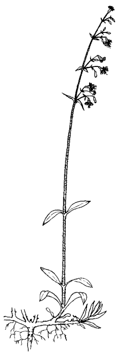
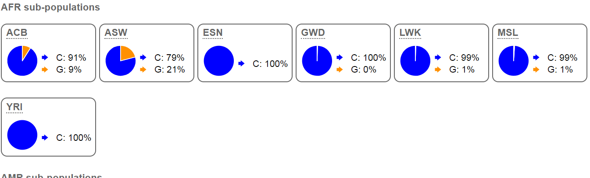
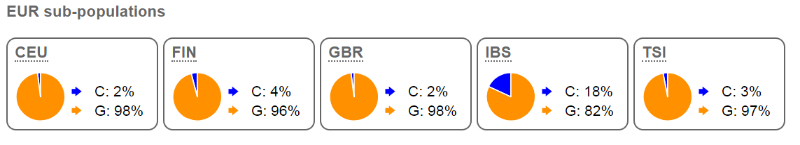
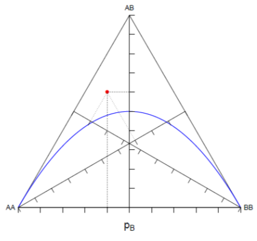
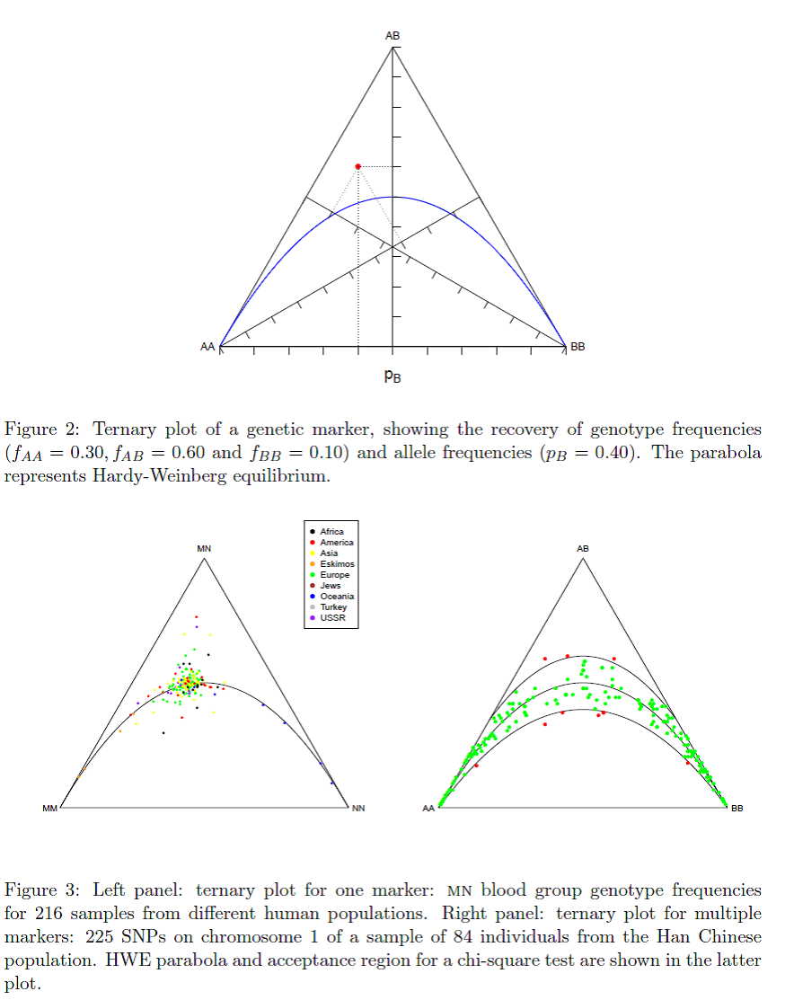
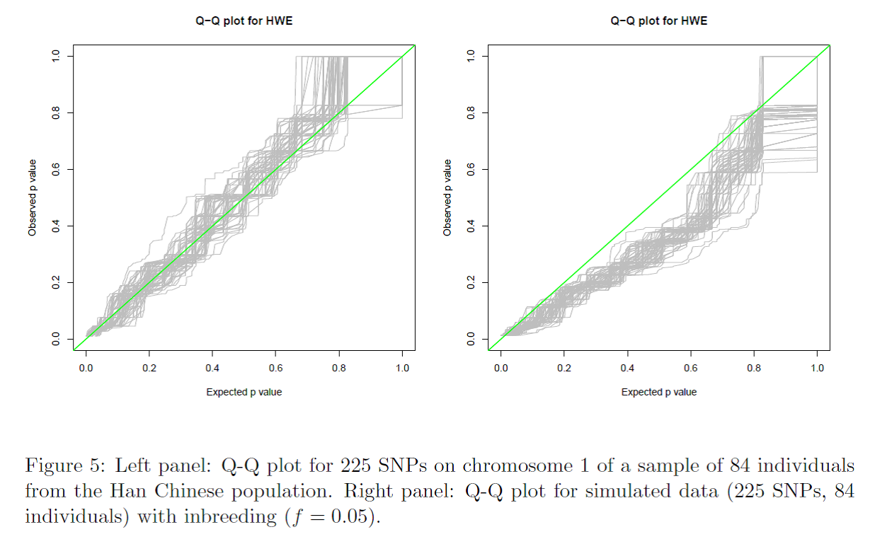

# Hardy-Weinberg exercise

**Hans R Siegismund and Ida Moltke**

The focus of these exercises is to

  - estimate allele and genotype frequencies
    
      - for autosomal loci with codominance among alleles
    
      - for autosomal loci where one allele is dominant

  - estimate expected Hardy-Weinberg proportions

  - test for deviations from Hardy-Weinberg proportions

  - quantify deviations from Hardy-Weinberg proportions with the
    inbreeding coefficient *F*

  - (only if there is time) carry out a graphical test for multiple diallelic markers
    
      - Plotting genotypic distributions in deFinetti diagrams
    
      - Using QQ plots to check whether the data can be described
        according to the null hypothesis

 
**Note 1:** It is advisable to do all the calculations by hand to get used to it. 

**Note 2:** Once you are familiar with R you can redo exercise 2 and 3. If you want to do exercise 4 you can do it using 
Jan Graffelman’s "HardyWeinberg" R package described in the
paper “Exploring Diallelic Genetic Markers: The HardyWeinberg Package”,
which is available from the Comprehensive R Archive Network (CRAN) at
<http://CRAN.R-project.org/package=HardyWeinberg>. NB This package is already installed on the popgen server! 
So, please do not reinstall it. It takes some time, and we don't need 50 independent copies for all users.


<!---
your comment goes here
and here
-->


 
<!---<figure class="image">
    
    <figcaption><em> Phenylalanine</em><figcaption>
</figure>


<em>image_caption</em>
</p>

<div align="right">
    
    <br>
    <em>Phenylalanine</em>
</div> 
--> 

 <figure>
  
 </figure>

 **Exercise 1**  
In Denmark, each year 6 children are born that are homozygotes for
deleterious alleles at the phenylkenuria (PKU) locus (Følling's
disease [ Named after Asbjørn Følling, a Norwegian that discovered PKU in 1934.])
These children are given a diet with a low concentration of
phenyalanine to prevent them from developing a severe mental disease. In
total, 60,000 children are born.


1)  What is the frequency of the deleterious allele? (Assume that there
    are Hardy-Weinberg proportions.)

2)  How many carriers (healthy heterozygotes) are born each year?

3)  What is the fraction of affected children where both parents don’t
    have the disease? (*NB.* skip until you have solved exercise 2 and 3 and then return to it if you have more time by then).

Hint for question 3:
One way to solve it is to step by step do as follows

a)  calculate the probability that a random set of parents consists of two healthy carriers

b)  calculate the probability that the child of such a set of parents gets the disease

c)  use a, b & the fact that there are 60000 children to calculate how many children you expect will have healthy parents but get the disease
    
d)  finally calculate how big of proportion your number in c constitutes of the 6 children with the disease


**Exercise 2**
*Silene nutans* is a hermaphroditic plant that is
self-compatible (It can fertilize itself.). In a study of this plant, genetic variation at
two life stages was recorded in a population: seedlings and adult
plants. In the table below the genotype distributions at an enzyme locus
are given

||||||
|--|--|--|--|--|
||AA| AB| BB| Sum|
|Seedlings O| 79 |43 |21 |143|
|Seedlings E|    |   |   |   |
|Adults    O| 70 |60 |13 |143|
|Adults    E|    |   |   |   |

  <figure>
  
 </figure>

1)  Estimate the allele frequencies in the two groups.

2)  Do the allele frequencies differ between the groups?

3)  Do the genotype distributions differ from Hardy-Weinberg
    proportions?

4)  Estimate the inbreeding coefficient *F* for both groups. \[*F* =
    (*H<sub>E</sub>* – *H<sub>O</sub>*)/*H<sub>E</sub>*, where
    *H<sub>E</sub>* and *H<sub>O</sub>* are the expected and observed
    frequencies of heterozygotes.\]

5)  What could have caused the differences in HW proportions between the
    groups? (if you do not know, then just move to the next question. We will reveal it in the solutions.)

6)  What is happening among the seedling stage and the adult life stage? (if you do not know, then just move to the next exercise)


<!---**Note 1:** It is advisable to do the calculations by hand to get used to it. 
You
can in addition use the “Hardy Weinberg Test” sheet in “Hardy Weinberg
test, LD test.xls” file to estimate the various parameters. (There is a
link to it in Absalon under “The Hardy-Weinberg law”.)
**Note 2:** Once you are familiar with R you can redo the exercise using 
Jan Graffelman’s "HardyWeinberg" R package described in the
paper “Exploring Diallelic Genetic Markers: The HardyWeinberg Package”,
which is available from the Comprehensive R Archive Network (CRAN) at
<http://CRAN.R-project.org/package=HardyWeinberg>. On the popgen server this package is already installed.
So, please do not reinstall it. It takes some time, and we don't need 50 independent copies for all users.

*If you want to install it on your own computer:*

Open R and copy the following in the command line

```
install.packages("HardyWeinberg")


```


**Analyzing the Silene nutans data**

Open R and copy the following in the command line

```
library("HardyWeinberg")
Seedlings <- c(AA = 79, AB = 43, BB = 21)
HW.test.Seedlings <- HWChisq(Seedlings, cc = 0, verbose = TRUE)
HW.test.Seedlings
Adults <- c(AA = 70, AB = 60, BB = 13)
HW.test.Adults <- HWChisq(Adults, cc = 0, verbose = TRUE)
HW.test.Adults


```

If you want to quit R just type

```
q()
n

```
-->
**Exercise 3**
A young unexperienced biologist has collected data for the human SNP
rs16891982 for Europeans (EUR) and Africans (AFR). He found the
following variation at this SNP:

||||||
|--|--|--|--|--|
||CC |CG| GG |Sum|
| AFR O| 617| 41 |&nbsp; &nbsp;3 |661|
| AFR E|||||
| EUR O| &nbsp; &nbsp;  4 |54 |445| 503|
| EUR E|||||


1)  Estimate the allele frequencies in the two groups.

2)  Do the allele frequencies differ between the groups? (A statistical
    test should not be necessary.)

3)  Do the genotype distributions differ from Hardy-Weinberg
    proportions?

4)  What could have caused a possible deviation from Hardy-Weinberg
    proportions?

**Hint**

The student has
taken the data from the
[Ensembl](https://www.ensembl.org/Homo_sapiens/Variation/Population?db=core;r=5:33951088-33952088;v=rs16891982;vdb=variation;vf=575051879)
database. Here, it turns out that the African population consists of the following subpopulations:


<figure>
  
 </figure>

|||
|--|--|
|ACB| African Caribbean in Barbados|
|ASW |African Ancestry in Southwest US|
|ESN |Esan in Nigeria|
|GWD |Gambian in Western Division, The Gambia - Mandinka|
|LWK |Luhya in Webuye, Kenya|
|MSL |Mende in Sierra Leone|
|YRI |Yoruba in Ibadan, Nigeria|

The European population consists of the following subpopulations


<figure>
  
 </figure>

|||
|--|--|
|CEU |Utah residents (CEPH) with Northern and Western European ancestry|
|CEPH | Centre d'Etude du Polymorphism Humain|
|FIN| Finnish in Finland|
|GBR| British in England and Scotland|
|IBS| Iberian populations in Spain|
|TSI| Toscani in Italy|


5)  In which gene is the SNP found?

    Hint: you can use the ensembl link above, pick location "5:33951588 (forward strand)", press go and then click "View in dbSNP" under "Original source".
    
7)  Does the variation have an effect on the phenotype?

    Hint: same as in 5 but this time click under Clinical Significance in dbSNP. 

9)  Among the AFR subpopulations, two (ACB, ASW) seem to differ from the
others, which seem to be homogeneous. This is also the case for one
European subpopulation (IBS). What could the reason for this be?


<!---
**Analyzing the SNP rs16891982 data**

Open R and copy the following in the command line

```
library("HardyWeinberg")
AFR <- c("CC" = 617, "CG" = 41, "GG" = 3)
HW.test.AFR <- HWChisq(AFR, cc = 0, verbose = TRUE)
HW.test.AFR
EUR <- c("CC" = 4, "CG" = 54, "GG" = 445)
HW.test.EUR <- HWChisq(EUR, cc = 0, verbose = TRUE)
HW.test.EUR


```

**Important Note**: 
HWChisq reports the allele frequency of the rarest allele. So please,
don’t get confused when you interpret “AA”, “AB” and “BB” for the two
samples. They have been swapped in the African sample
-->
**Exercise 4**

In this exercise, we will analyze datasets that consists of a larger
number of loci. For this purpose we will use the HardyWeinberg R
package. There are two datasets: CEU\_500.hw and CEU\_500.sim. The first
dataset consists of 500 diallelic SNPs from a sample of 60 humans of
CEU origin (Utah residents (CEPH) with Northern and Western European ancestry,
CEPH: Centre d'Etude du Polymorphism Humain). The second dataset is a simulated dataset of 500 SNPs
where one of the assumptions for having Hardy-Weinberg proportions is
violated. The simulations have been carried out for 500 separate
populations. There is no admixture among populations. The sample size is
60 for both datasets.

*Get the two files:*
First login to the teaching server. 
In the Linux terminal you then run the following commands (which means you make a directory called exercises, go into that directory, then make a directory called HardyWeinberg, go into that and finally copy the data files you need into this directory):

```
cd 
mkdir exercises
cd ~/exercises
mkdir HardyWeinberg
cd HardyWeinberg
cp /course/popgenmsc26/exercises/HardyWeinberg/CE* .
```

Next you should analyses (in the \~/exercises/HardyWeinberg folder) the two data sets using R:

So open R and copy the following in the command line

```
library("HardyWeinberg")
SNP_data <-as.matrix(read.table("CEU_500.hw", header=TRUE))
SNP_sim_data <-as.matrix(read.table("CEU_500.sim", header=TRUE))
#How does the data look like?
head(SNP_data)
#Plot the genotype frequencies for each of the 500 populations
#in a deFinetti diagram and indicate populations that differ
#signicantly from Hardy-Weinberg proportions.
par(mfrow=c(1,2))
HWTernaryPlot(SNP_data, region = 1,
              curvecols=c("black", "red","green","black","purple"),
              vbounds = FALSE, main ="Original CEU data",
              cex = 0.5, cex.main=1.5, font.main = 1)
HWTernaryPlot(SNP_sim_data, region = 1,
              curvecols=c("black", "red","green","black","purple"),
              vbounds = FALSE, main ="Simulated data",
              cex = 0.5, cex.main=1.5, font.main = 1)


```

<figure>
  
 </figure>
The plots are explained in “Graphical test for
multiple diallelic markers”; see below. In short, each dot indicates the
genotypic proportion at a locus. The distance of a dot perpendicular to
the *X*-axis indicates the frequency of hetero­zygotes at the locus.
Similarly, the distances of the dot perpendicular to the other two sides
of the triangle indicate the frequency of the two homozygotes. In the
example to the right, the genotype frequencies are

&nbsp;&nbsp;AA: 0.3
&nbsp;&nbsp;AB: 0.6
&nbsp;&nbsp;BB: 0.1

In the two plots produced in R the parabola in the middle indicates
Hardy-Weinberg proportions. The other two curves indicate the acceptance
regions for a chi-square test with one degree of freedom at a
significance level of 0.05. Loci that deviate significantly from
Hardy-Weinberg proportions are indicated in red, whereas loci that do
not deviate significantly are indicated in green. Values above the upper
curve indicate an excess of homozygotes and those below the lower curve
indicate a deficiency of heterozygotes compared to Hardy-Weinberg
proportions.

1)  Are there any indications that the original SNP data has genotypic
    proportions that deviate significantly from Hardy-Weinberg
    proportions?                                                                                                               (Hint 1: How many significant tests at a significance level of
    0.05 do you expect to see? Hint 2: Copy the following in the command line into R to count the number of
significant tests observed:

```
#First make a vector with chi test values
#using the function HWChisqStats
chitest  <- HWChisqStats(SNP_data,pvalues=FALSE)
#Then make a vector with significant tests
sigchitest <-chitest[chitest>3.84]
length(sigchitest)
```
2)  Do the simulated dataset overall agree with Hardy-Weinberg
    proportions?

3)  What could the reason for a deviation from Hardy-Weinberg
    proportions be?

We can use Q–Q (quantile-quantile) plots to check whether the data
perform as expected. In this case, we check whether the genotypic
proportions are the expected Hardy-Weinberg proportions. We use the
HardyWeinberg package to do this. See **6.4. Q-Q plots** below in this
exercise.

“The function HWQqplot of the package plots the p values against samples
from the null distribution.” It uses 100 simulations to compare observed
and expected *p* values. If they perform as expected from the null model
(Hardy-Weinberg), they will be distributed around the green line where
the observed and expected values are equal..

*In R copy the following in the command line*

```
par(mfrow=c(1,2))
HWQqplot(SNP_data,
         main ="Q-Q plot for original data")
HWQqplot(SNP_sim_data,
         main ="Q-Q plot for simulated data")

```

Use these simulations to support your answers to the previous three
questions.


##  **Graphical test for multiple diallelic markers**

The following has been copied from Jan Graffelman’s HardyWeinberg R
package described in the paper “Exploring Diallelic Genetic Markers: The
HardyWeinberg Package”, which is available from the Comprehensive R
Archive Network (CRAN) at
<http://CRAN.R-project.org/package=HardyWeinberg>.

**6. Graphics for Hardy-Weinberg equilibrium**

**6.2. The ternary plot**

The Italian statistician Bruno De Finetti (1926) represented genotype
frequencies in a ternary diagram. This diagram is known as a de Finetti
diagram in the genetics literature (Canning sand Edwards 1968). The HWE
condition defines a parabola in the ternary plot. A ternary plot of the
genotype frequencies with the HWE parabola is an information-rich
graphical display. From this plot one can recover genotype frequencies,
allele frequencies, and infer the equilibrium status of a genetic marker
at a glance (see Figure 2). The ternary plot is most useful for plotting
data consisting of multiple samples that have all been genotyped for the
same genetic marker. In that case the three vertices of the display are
fully identified. An example is shown in Figure 3 where the genotype
counts for the MN blood group locus are shown for 216 samples of various
human populations from different geographical origin (Mourant et al.
1976, Table 2.5). The plot shows relatively higher allele frequencies
for the N allele for samples from Oceania, and lower allele frequencies
for this allele for the Eskimo samples. African, American, European and
Asian populations have intermediate allele frequencies. Most samples
clearly cluster around the HWE parabola though there are several
deviating samples as well. The ternary plot may also be used to
represent multiple markers, though this is a bit tricky because the
obtained display is no longer uniquely determined. In this case, one
vertex, usually the top vertex, is chosen to represent the heterozygote
frequency of each marker. The two bottom vertices are used for one of
the two homozygote frequencies. It is arbitrary to place aa on the right
and bb on the left or the other way round. Representing multiple markers
amounts to overplotting all ternary diagrams for each individual marker
in such a way that the axes for the heterozygotes always coincide.
Despite the indeterminacy of the homozygote vertices, the plot remains
highly informative, as now minor allele frequency, genotype frequencies
and equilibrium status are visualized simultaneously for many markers in
just one plot. Graffelman and Morales-Camarena (2008) amplified the
ternary plot by representing the acceptance regions of chi-square and
exact tests inside the plot. An example with multiple markers is shown
in the right panel of Figure 3. This figure shows 225 SNPs of the
dataset HapMapCHBChr1. The function HWTernaryPlot of the package allows
the construction of ternary plots with the equilibrium parabola and
various acceptance regions.

<figure>
  
 </figure>

…

6.4. Q-Q plots

Genetic association studies nowadays investigate many markers for their
possible relation with diseases. The equilibrium status of the markers
is important, since deviation from HWE may be indicative of genotyping
error. Moreover, disequilibrium for cases in a case-control study is
indicative for disease association. Given that so many markers are
tested, it is cumbersome to do this all in a numerical manner only, and
it is known beforehand that false positives will arise. Even if we find
that 5% of the markers is significant when we use a significance level
of α = 0:05, this does not imply that the database as a whole can be
considered to be “in equilibrium”. The distribution of the test results
(chi-square statistics or p values) then becomes interesting to look at.
One way to do this is to compare the sample percentiles of the
chi-square statistics of all markers with the theoretical percentiles of
a ­\(\chi_{1}^{2}\) distribution in a chi-square quantile-quantile plot
(Q-Q plot). For exact tests, Q-Q plots of the p values are used. Often
the uniform distribution is chosen as the reference distribution.
However, with discrete data the p value distribution under the null is
not uniform. The function HWQqplot of the package plots the p values
against samples from the null distribution rather than the uniform
distribution. The function takes into account that sample size and
allele frequency can vary over markers. Figure 5 shows Q-Q plots for the
HapMap data (left panel) and also for simulated data under moderate
inbreeding (right panel, f = 0.05). The green line is the reference line
passing through the origin with slope 1. Each grey line plots a sample
from the null distribution against the empirical quantiles of the p
values. Deviation of the green line from the grey zone is taken as
evidence that HWE is violated. The HapMap data set is seen to be in good
agreement with what is expected under the null. This is not surprising,
as the markers of the project undergo a quality control filter, and
markers that strongly deviate from HWE (p value of an exact test \<
0.001) are discarded from the project. For the dataset simulated under
inbreeding, a manifest deviation from HWE is found. Q-Q plots assume
independent observations. We note that this assumption will be violated
if the markers under study are closely neighboring markers from the same
region of a single chromosome.

<figure>
  
 </figure>


