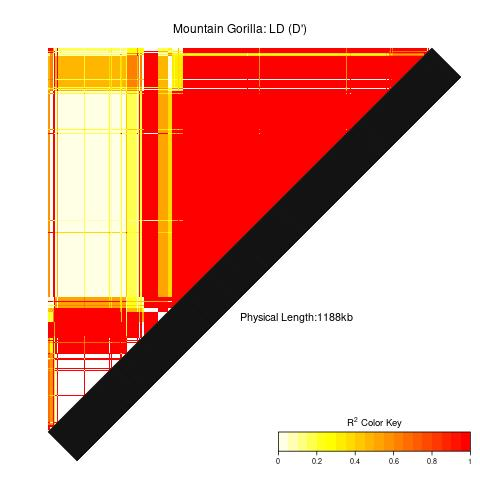
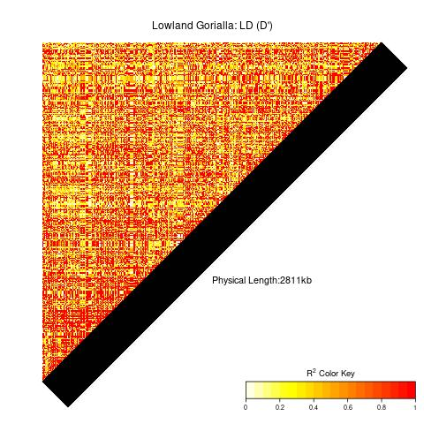
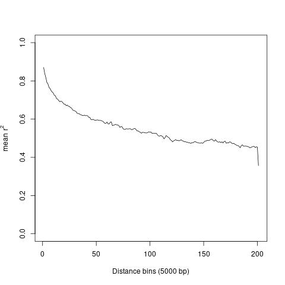
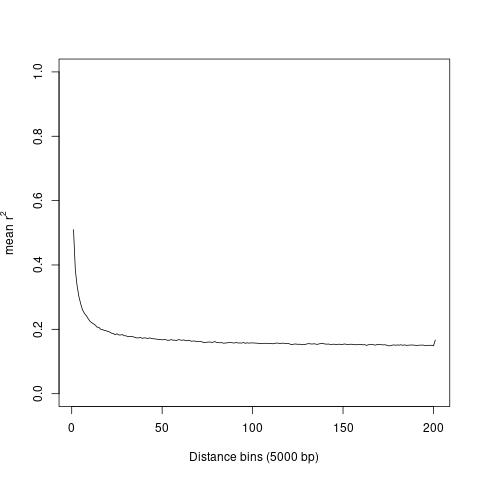

# Linkage Disequilibrium in Small and Large Populations of Gorillas

**Shyam Gopalakrishnan (inspired by Peter Frandsen's and Hans Siegismund's exercises)**

## Program

<figure>
  
</figure>

  - Apply filters to prepare data for analysis
  - Explore patterns of LD blocks in two populations of gorilla
  - Estimate mean pairwise LD between SNP’s along a chromosome
  - Plot and compare curves of LD decay in two populations of gorilla

## Learning outcome

  - Get familiar with common filtering procedures in genome analyses
    using PLINK
  - Get familiar with running analyses in R and the code involved
  - Understand the processes that builds and breaks down LD
  - Understand the link between patterns of LD and population history

## Essential background reading

Nielsen and Slatkin: Chapter 6 - Linkage Disequilibrium and Gene Mapping
p. 107-126

## Key concepts that you should familiarize with:

  - Definition of linkage disequilibrium (LD)

  - Measures of LD

  - Build-up and breakdown of LD

  - Applications of LD in population genetics

### Suggestive reading
Prado-Martinez et al. (2014) [Great ape genetic diversity and population
history](http://www.nature.com/nature/journal/v499/n7459/full/nature12228.html)

# Introduction

Gorillas are among the most critically endangered species of great apes.
The *Gorilla* genus consists of two species, with two subspecies each.
In this exercise, you will work with chromosome 4 from the western
lowland subspecies and the mountain gorilla subspecies. The former is
distributed over a large forest area across the Congo basin in East
Africa (yellow in fig. 1), while the mountain gorilla is confined to two
small populations in the Virunga mountains and the impenetrable forest
of Bwindi (encircled with red in fig. 1). The mountain gorilla, in
particular, has been subject to active conservation efforts for decades,
yet, very little is known about their genomic diversity and evolutionary
history. The data you will be working with today is an extract of a
large study on great ape genomes (Prado-Martinez et al.
2014).

 <figure>
  
 </figure>

**Figure 1 Distribution range of the *Gorilla* genus.** The large yellow patch indicates the distribution of western lowland gorilla (*Gorilla gorilla gorilla*). The distribution of mountain gorilla (*Gorilla beringei beringei*) is encircled with red. Reprint from [http://maps.iucnredlist.org,](http://maps.iucnredlist.org/) edited by Peter Frandsen.

## Getting started

Start by downloading the compressed folder ‘gorillas.tar.gz’ to your
exercise folder unzip, and navigate to the folder ‘LD’ with the
following commands: (We assume that the folder exercises exists in your home folder; otherwise create it `mkdir ~/exercises`)

```bash
cd ~/exercises
cp /course/popgenmsc26/exercises/LD/gorillas.tar.gz .
tar -zxvf gorillas.tar.gz
rm gorillas.tar.gz
```

All code needed in the exercise is given below. It will be indicated
with an **\>R** when you need to run a command in R, otherwise stay in
your main terminal.

## LD blocks

In this first part of the exercise we will explore a specific region of chromosome 4 in terms of blocks of LD. We have not chosen this region for any specific reason and the emerging patterns should serve as a general comparison of LD in the two populations. First step will be to extract a pre-defined region using PLINK and run a LD anaysis with snpStats and LDheatmap in R. The results will be written to an .jpg file that you can open.

### Mountain Gorilla

```bash
cd LD
plink --file mountain --maf 0.15 --geno 0 --thin 0.25 --from 9029832 --to 14148683 --make-bed --out mountainBlock
```

#### \>R

```R
library(LDheatmap)
library(snpStats)
## Read the plink file, and split it into the genotype, and map file.
mountain <- read.plink("mountainBlock")

# ld() can return r^2 and D'
# We compute LD D' and then plot using the LDheatmap function.
mountain.dprime <- ld(mountain$genotypes, depth = ncol(mountain$genotypes) - 1, 
    stats = c("D.prime"))
## plot the LD heatmap
jpeg(filename="Mountain.jpg")
LDheatmap(as.matrix(mountain.dprime), title="Mountain Gorilla: LD (D')", 
    color=heat.colors(20), SNP.name = NULL, add.map=TRUE)
dev.off()
q()
```

### Western Lowland Gorilla

```bash
plink --file lowland --maf 0.15 --geno 0 --thin 0.25 --from 9029832 --to 14148683 --make-bed --out lowlandBlock
```

#### \>R

```R
library(LDheatmap)
library(snpStats)
## Read the plink file, and split it into the genotype, and map file.
lowland <- read.plink("lowlandBlock")

# ld() can return r^2 and D'
# We compute LD D' and then plot using the LDheatmap function.
lowland.dprime <- ld(lowland$genotypes, depth = ncol(lowland$genotypes) - 1, 
    stats = c("D.prime"))
## plot the LD heatmap
jpeg(filename="WesternLowland.jpg")
LDheatmap(as.matrix(lowland.dprime), title="Lowland Gorialla: LD (D')", 
    color=heat.colors(20), SNP.name = NULL, add.map=TRUE)
dev.off()
q()```

**NB**: the .jpg files are quite heavy and loading the output could take a long time. You can start to open the .jpg file with the commands

```bash
eog Mountain.jpg & # the ‘&’ will make the command run in the background
eog WesternLowland.jpg &
```

**NB**: this will take approximately five minutes to load.*

**Q1:** How would you characterize the structure you observe in the
different populations?
<details>
  <summary>Answer: </summary>

<figure>
  
 </figure>

<figure>
  
 </figure>
 
The mountain gorilla genome consists of large regions with blocks of
high LD, while recombination has broken down such patterns in the
the western lowland gorilla.
</details>

**Q2:** How many (if any) recombination hotspots can you identify in the two populations (crude estimate)?
<details>
  <summary> Answer: </summary>

Mountain gorilla has *at least two* LD blocks, while the western lowland gorilla has no LD blocks in this region.
</details>

## LD decay
In this part of today’s exercise we will explore the decay of LD as a function of distance along the chromosome. This will enable us to compare the two populations in terms of mean distances on the chromosome with sites in LD. To begin with, we will do some essential filtering procedures common to this type of analysis and then, again, read the data into R and run the analyses with snpStats and a custom function.

### Filtering

We are going to make smaller files with far fewer markers for both populations. 

```bash
plink --file mountain --maf 0.15 --geno 0 --thin 0.15 --make-bed --out mountainLD
plink --file lowland --maf 0.15 --geno 0 --thin 0.15 --make-bed --out lowlandLD
```

**Q3:** Why do we exclude markers with low minor allele frequencies (less than 0.15) (i.e. the less common or rare alleles in the population)?
<details>
  <summary>Answer: </summary>
 Newly arisen and rare mutations will distort the LD pattern (elevate the mean D', and reduce the r2). 
 Remember, every new mutation on a chromosome is in complete LD with the rest of the markers on the chromosome. 
 For most LD analyses, we are also more interested in the common variation. On the plus side, we also get rid of sequencing errors (which should show up as rare variants, hopefully), and reduce the computational burden.
</details>

**Q4:** What else are we filtering away? See list of options in [PLINK](https://www.cog-genomics.org/plink/) 
<details>
  <summary> Answer: </summary>

`--geno 0` : removes all missing data

`--thin 0.15` : removes a random 85% of the data (keeps 15%), otherwise we would not get through the exercise in just two hours. Plus, it is not always necessary to keep all your data to get the summary information. Sometimes, only a fraction of your data will tell you the same story as a complete and computational heavy dataset.

`--maf 0.15` : removes all markers with a minor allele frequency less than 15%
</details>

**Q5:** How many SNPs did we have before and after filtering? (Hint: look at the log on the screen for information on the plink process)
<details>
  <summary>Answer: </summary>

Mountain gorilla: 2.521.457 SNPs before, 23.518  SNPs after filtering

lowland gorilla: 2.521.457 SNPs before, 48.318 SNPs after filtering

In other words, you threw away a lot of data (but you can still reach
the same conclusion as if we had looked at the whole genome). Your numbers after filtering may be different due to some randomness in the thinning process. 
</details>

### Run the commands

This script will load the package snpStats, read in the plink files, and estimate the mean LD between SNP pairs in a pre-set range (dep) using a custome function . At the end of the script, the result will be plotted to a .jpg file.

### Mountain Gorilla and Western Lowland Gorilla (LD decay)

**\>R** *(paste in the whole script)*

```R
ld.decay <- function(r2matrix, pos, max_dist_bp=1e6, bin_width_bp=5000, 
                     outfile="test.jpg") {
## Convert the ld matrix to a upper triangular matrix, and get the indices of the
## elements in the upper triangular matrix.  
    ut <- which(upper.tri(r2matrix), arr.ind = TRUE)
    i <- ut[, 1]
    j <- ut[, 2]

## Compute the distances between pairs of markers, and retain only ones
## which are closer than the max distance 
    dist_bp <- abs(pos[j] - pos[i])
    keep <- (dist_bp <= (max_dist_bp+1))

## Update the indices and distances, and r2 measures to keep only the chosen ones
    i <- i[keep]
    j <- j[keep]
    dist_bp <- dist_bp[keep]
    r2 <- r2matrix[cbind(i, j)]

    # Optional: drop NAs
    ok <- !is.na(r2) & !is.na(dist_bp)
    dist_bp <- dist_bp[ok]
    r2 <- r2[ok]

## Compute the mean r2 based on distance by putting them in the correct bin. 
    mean_r2_by_bin <- tapply(r2, as.integer(dist_bp/bin_width_bp), 
                             mean, na.rm = TRUE)

## Plot the decay curves and store them in the jpeg files
    jpeg(filename=outfile)
    plot(mean_r2_by_bin, type = "l", ylim = c(0.0, 1.0), col = "black",
         xlab = paste0("Distance bins (", bin_width_bp, " bp)"),
         ylab = expression(mean~r^2))
    dev.off()
}

library("snpStats")

mountainLD <- read.plink("mountainLD")
mountain.ld <- ld(mountainLD$genotypes, depth=500, stats=c("R.squared"))
ld.decay(as.matrix(mountain.ld), mountainLD$map[["position"]], outfile="Mountain_LDdecay.jpg")

lowlandLD <- read.plink("lowlandLD")
lowland.ld <- ld(lowlandLD$genotypes, depth=500, stats=c("R.squared"))
ld.decay(as.matrix(lowland.ld), lowlandLD$map[["position"]], outfile="WesternLowland_LDdecay.jpg")
```


Look through the script to get an idea about what is going on - esp. the function, 
read the comments to see what is being done. 

**Q6:** How many pair-wise comparisons have we done for each marker (*depth* in ld function)?
<details>
  <summary>Answer: </summary>
500 from the command `ld(mountainLD$genotypes, depth=500, stats=c("R.squared"))`
</details>

**Q7:** Look at the two plots and explain why LD decays with distance.
<details>
  <summary> </summary>

***Mountain Gorilla LD decay:***
<figure>
  
 </figure>
 
***Western Lowland Gorilla LD decay:***
<figure>
  
 </figure>

LD is broken down by recombination, with increasing distance between two
sites, the likelihood of a recombination event increases. See plots
above.
</details>

**Q8:** What is the mean *r2* at distance 1M (100 on the x-axis) in the
two populations?
<details>
  <summary>Answer: </summary>

Mountain gorilla: ~0.45

Western lowland gorilla: ~0.15
</details>

**Q9:** What could explain any observed difference in the decay of LD in
the two populations?
<details>
  <summary>Answer: </summary>
Most likely explanation in these populations is the difference in the population history, and population size. But there can be other factors as well, such as selection (genetic hitchhiking), admixture, and genetic drift. 
</details>


**Q10:** These estimates are done on an autosomal chromosome, would you
expect different LD patterns in other parts of the genome?
<details>
  <summary>Answer: </summary>

Yes, there is no (or very little) recombination on the Y chromosome and
the mitochondria; hence, you would not observe a decay with increasing
distance.
</details>

## Perspectives

**Q11:** Keeping what you saw in the gorillas, how do you think the 
trajectory of the LD decay and the LD block patterns would look like 
in humans?
<details>
  <summary>Answer: </summary>

LD decays at a rate similar to the western lowland gorilla and large
parts of the genome will show comparable patterns in terms of LD blocks.
Only for very small human population, that has been isolated for a long
time, would we observe anything as extreme as in the mountain gorilla.
</details>

**Q12:** Would you also expect different patterns of LD in human
populations (*e.g.* Chinese, Europeans, and Africans)? Where would 
LD be highest and LD decay be slowest? Why?
<details>
  <summary>Answer: </summary>

Populations that have gone through historic bottlenecks, been subjected
to genetic drift, admixture or selection will on average have a higher
degree of LD. As an example, populations that went through a bottleneck
when they migrated out of African (*e.g.* Europeans), have on average a
higher degree of LD compared to most African populations.
</details>

