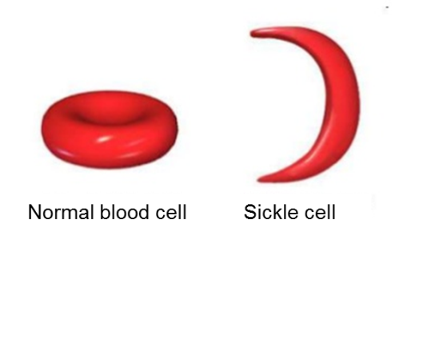
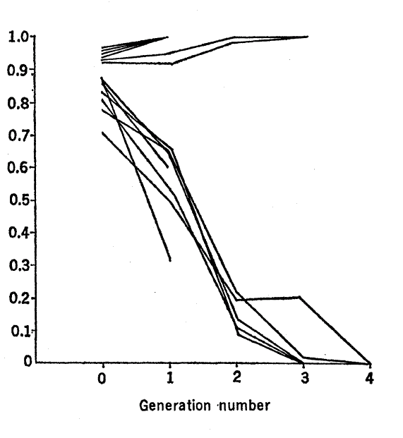
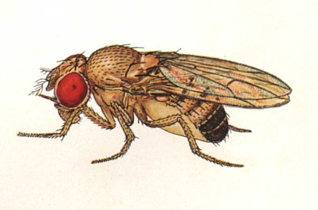
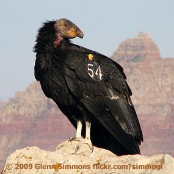

# Natural selection (and other complications)

**Hans R. Siegismund**

**Exercise 1**

 <figure>
  
 </figure>
  In Africa and southern Europe, many human
populations are polymorphic at the locus coding for the beta-hemoglobin
chain. Two alleles are found, HbS, and HbA. HbS differs from HbA in that
it at the position 6 the amino acid glutamic acid has been replaced with
valine. A study in Tanzania found the following genotypic distribution:

|          | HbAHbA | HbAHbS | HbSHbS | Sum |
|----------|:----------------------------:|:----------------------------:|:----------------------------:|---|
| Adults   | 400                          | 249                          | 5                            | 654 |
| Children | 189                          | 89                           | 9                            | 287 |

1)  Estimate the allele frequencies in both groups.

2)  Do the observed genotype distributions differ from Hardy-Weinberg
    proportions?

3)  Under the assumption that the polymorphism has reached a stable
    equilibrium, estimate the fitness of the three genotypes. Hints:
    Assume that the adults had a genotypic distribution equal to their
    expected Hardy-Weinberg distribution and estimate their relative
    fitness.

In African Americans, one out of 400 suffers of sickle cell anemia.

4)  Estimate the allele frequencies among them

5)  Why is it lower than the frequency observed among Africans?

**Exercise 2**

 <figure>
  
 </figure>

The figure to the right shows the result of 13 repeated experiments with
a chromosomal polymorphism in *Drosophila meanogaster*. It shows the
frequency of one of the two chromosomal forms through four generations
the experiment lasted. In six of the experiments one type had
frequencies slightly higher than 0.9 and 7 of the experiments had levels
below 0.9. Population sizes in each experiment were 100.

1)  Can the evolution of this system be explained as a result of  genetic drift?

2)  Can the evolution be explained as a result of natural selection?
    How does it work? Which genotype has the lowest fitness?

**Exercise 3**

<figure>
  
 </figure>

A geneticist starts an experiment with *Drosophila melanogaster*. He
uses 10 populations, each kept at a constant size of 8 males and 8
females in each generation. In generation 0 all individuals are
heterozygous for the two alleles *A*1 and *A*2 at
an autosomal locus. After 19 generations, the following distribution of
the allele frequency of *A*1 is observed in the 10
populations:

|0.18 |0.00 |0.18| 0.25| 0.30| 0.19| 0.16| 0.00| 0.15| 0.00|
|-----|-----|----|-----|-----|-----|-----|-----|-----|-----|

1)  Can this distribution of the allele frequency be explained by
    genetic drift?

2)   Which other evolutionary force has also worked during this
    experiment?

After 100 generations, all ten populations were fixed for allele
*A*2*.*

3)  Use this information to explain how the fitness of the three
    genotypes, *w*11, *w*12 and *w*22,
    are related to each other.

**Exercise 4**

<figure>
  
 </figure>

After the arrival of the Europeans in America,
the California condor (*Gymnogyps californianus*) was severely hunted.
This resulted in a drastic decline in population size, which culminated
in 1987 when the last wild condors were placed in captivity (fourteen
individuals). [Later on, the condor was released again. In 2014, 425 were living in
    the wild or in captivity.] Among the progeny of these fourteen individuals
the genetic disease chondrodystrophy (a form of dwarfism was observed).
In condor, this disease is inherited at an autosomal locus where
chondrodystrophy is due to a recessive lethal allele.

1)  What has the frequency of the allele for chondrodystrophy at least
    been among the fourteen individuals who were used to found the
    population in captivity?

The population has since grown in number and reached around a few
hundred. An estimation of the allele frequency for chondrodystrophy
showed a value of 0.09.

2)  Can the frequency of this lethal allele be caused by one of the
    following three forces separately? (In question c you will be asked
    whether a combination of these forces is needed to explain the
    frequency.)

- mutation
- genetic drift
- natural selection

3)  Is it necessary to consider that two or three of these forces act
    together to explain the frequency of this allele?

4)  What is the expected frequency of the allele after a balance
    between mutation and selection? The mutation rate can be assumed to be μ =
    10-6?

**Exercise 5**

Cystic fibrosis is caused by a recessive allele at a single autosomal
locus, CTFR (cystic fibrosis transmembrane conductance regulator). In
European populations 1 out of 2500 newborn children are homozygous for
the recessive allele.

1)  What is the frequency of the recessive allele in these populations?

2)  What fraction of all possible parental combinations has a
    probability of ¼ for having a child which is homozygous for the
    recessive allele?

The disease used to be fatal during childhood if it is not treated.
Therefore, it must be assumed that the fitness of the recessive
homozygote must have been 0 during the main part of the human
evolutionary history.

3)  Estimate the mutation rate, assuming equilibrium between the
    mutation and selection.

A direct estimate of the mutation rate was 6.7 × 10-7, which
is considerably lower than the estimate found in question c.

4)  Which mechanism(s) may explain the high frequency of the recessive
    deleterious allele?

