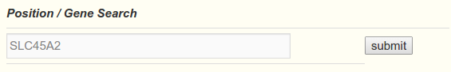
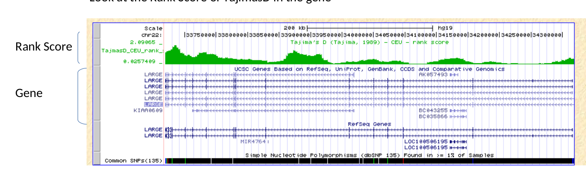
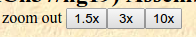

# Selection scan exercises Part 1
**Anders Albrechtsen**


Go to http://hsb.upf.edu/
This is a browser for selection for the 1000Genomes project. This is the largest publicly available data set for humans with more than 2500 fully sequenced individuals. 

  - Uncheck everything except Tajima’s D
  - Try the SLC45A2 gene in Europeans - this is one of the strongest selected genes in Europeans
 <p align="center">
   
   
 </p>
<br/>
 
  - Look at the Rank Score of TajimasD in the gene
 <figure>
  
 </figure>


 <figure>     </figure>  
 
  - Zoom out a factor 10X 
  - The score is a rank based score for how extreme the loci is. The p-value can be interpreted as the fraction of the genome that is more extreme than this loci.  P-value = 10-RankScore
   <figure>
  
 </figure>
  - The maximum value is 1.72405.  Is this an extreme loci?
  - Try to go to the LCT loci. How extreme is this?
  - Try to zoom out. Are the any sites in the genome that stick out
  - What can you conclude on the performance of Tajima’s D

# Part 2

Open R and run the shiny app
## in R 
```R
.libPaths( c( .libPaths(), "~/groupdirs/SCIENCE-BIO-Popgen_Course/exercises/Rlib/") )
shiny::runApp("groupdirs/SCIENCE-BIO-Popgen_Course/exercises/selection/selectionScan/")
```
**be patient – a browser window will pop up after ~ 30 sec.**

If you cannot copy paste then you can find the command in the Absalon module


**Exercise**

Let see if we can do better than the Tajima’s D by using the PBS statistics. First select 3 populations from 
  - NAT - Native Americans (PERU+Mexico)
  - CHB – East Asian - Han Chinese
  - CEU – Central Europeans
  - YRI – African - Nigerians
  
The first population is the one which branch you are investigating. The two others are the one you are comparing to. Chose CEU as the first and choose CHB and YRI as the two others. 

First lets get an overview of the whole genome by making a manhattan plot
  - Press “Run analysis”. 

Note which chromosomes have extreme values. A high value of PBS means a long branch length. 
To view a single chromosome – go to PBS region

Chose the chromosome with the highest PBS value and set the starting position to -1 to get the whole chromosome

Zoom in to the peak by changing start and end position. 

  - Locate the most extreme regions of the genome and zoom in
  - Identify the Gene with the highest PBS value.  
  - What does the gene do?
  - Try the LCT gene (the mutations are locate in the adjacent MCM6 gene). See below on how to get the position
  - How does this compare with Tajima’s D
  
If you have time you can try other genes. Here are the top ones for Humans. You can find the find the location of the genes using for example the ucsc browser https://genome-euro.ucsc.edu/cgi-bin/hgGateway   (choose human GRCh37/hg19 genome). Note that there are some population that you cannot test because the populations are not represented in the data e.g. Tibetan, Ethiopian , Inuit, Siberians.


