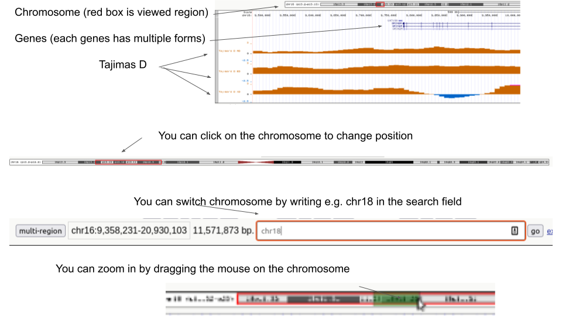

# Selection scan exercises Part 1
**Anders Albrechtsen**

  
Go to https://genome.ucsc.edu/s/aalbrechtsen/hg18Selection


This is a browser that can be used to view genomic data. With the above link you will view both genes and tajimas D for 3 populations. 
 - Individuals with African descent are named AD
 - Individuals with European descent are named ED
 - Individuals with Chinese descent are named XD
 - <br/><br/>
You are looking at a random 11Mb region of the genome. Try to get a sense of the values that Tajimas D takes along the genome for the 3 populations.
 - You can move to another part of the chromosome by clicking ones on the chromosome arm 
 - You can also change chromosome in the search field
 - You can zoom in by draging the mouse
 <figure>
  
 </figure>
 


Take note of the highest and lowest values of Tajimas D that you observed. 
<br/><br/>
  

Try find the SLC45A2 gene (use the search field, an choose the top option). This is one of the strongest selected genes in Europeans. 
 - Is this an extreme value of Tajimas D?

<br/><br/>
Try to go to the LCT loci. 
 - Does this have an extreme value of Tajimas D ?
 - What can you conclude on the performance of Tajima’s D

# Part 2
`


Open R and load data
## in R 
```R
## paste the following code in R ( you do not need to understand it)
.libPaths( c( .libPaths(), "~/groupdirs/SCIENCE-BIO-Popgen_Course/exercises/Rlib/") )
setwd("~/groupdirs/SCIENCE-BIO-Popgen_Course/exercises/selection/selectionScan")
source("server.R")

```

**Exercise**

Let see if we can do better than the Tajima’s D by using the PBS statistics. First select 3 populations from 
  - NAT - Native Americans (PERU+Mexico)
  - CHB – East Asian - Han Chinese
  - CEU – Central Europeans
  - YRI – African - Nigerians
  
The first population is the one which branch you are investigating. The two others are the one you are comparing to. Chose CEU as the first and choose CHB and YRI as the two others. 


```R
#### choose populations
#pops 1=NAT,2=CHB",3=CEU",4=YRI
myPops <- c(3,2,4)
```


First lets get an overview of the whole genome by making a manhattan plot


```R
#### choose populations
PBSmanPlot(myPops)
```

Note which chromosomes have extreme values. A high value of PBS means a long branch length. 
To view a single chromosome – go to PBS region

Chose the chromosome with the highest PBS value and set the starting position to -1 to get the whole chromosome

e.g. 


```R
# see entire chromosome 1
PBSmanRegion(myPops,chrom=1,start=-1)
```

Zoom in to the peak by changing start and end position. 

```R
# see region between 20Mb and 21Mb on chromosome 1
PBSmanRegion(myPops,chrom=1,start=20,end=21)
```

  - Locate the most extreme regions of the genome and zoom in
  - Identify the Gene with the highest PBS value.  
  - What does the gene do?
  - Try the LCT gene (the mutations are locate in the adjacent MCM6 gene). See below on how to get the position
  - How does this compare with Tajima’s D
  
If you have time you can try other genes. Here are the top ones for Humans. You can find the find the location of the genes using for example the ucsc browser https://genome-euro.ucsc.edu/cgi-bin/hgGateway   (choose human GRCh37/hg19 genome). Note that there are some population that you cannot test because the populations are not represented in the data e.g. Tibetan, Ethiopian , Inuit, Siberians.


