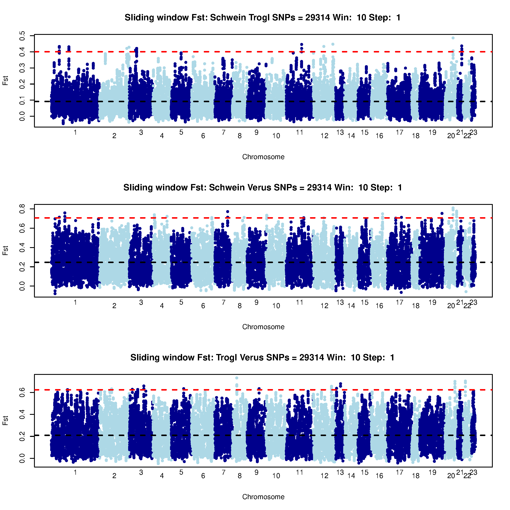

# Exercises - measuring population differentiation and detecting signatures of selection using F<sub>ST</sub>

## Aims

- Learn to estimate F<sub>ST</sub> between population pairs using genotype data.
- Learn to interpret F<sub>ST</sub> estimates in relation to processes of population divergence.
- Learn to visualise local F<sub>ST</sub> across the genome and identify candidate genes under selection.

## Outline

- Read genotype data into R and apply R functions to estimate F<sub>ST</sub> from the genotypes.
- Use F<sub>ST</sub> in windows across the genome and Manhattan plots to detect local signatures of natural selection.
- Interpret and discuss the results from both analyses in a biological context.

## Data and setup

For this exercise, we will use the same dataset that you used on Monday for [analysing population structure](https://github.com/populationgenetics/exercises/blob/master/Population_structure/ExerciseStructure_2022.md). 
The following commands will create a new folder and copy the dataset to that new folder,
but you are free to work in the `structure` folder that you created in the last exercise (in which
case, you can skip the following commands).

```bash
mkdir -p ~/exercises/structure_fst # make a directory called structure_fst inside ~/exercises/
cd ~/exercises/structure_fst 

# Download data (remember the `.` at the end)
cp ~/groupdirs/SCIENCE-BIO-Popgen_Course/exercises/structure/pa/* .

# List the downloaded files
ls -l
```

Today, we are going to calculate the fixation index (*F<sub>ST</sub>*), a widely used statistic in population
genetics, between subspecies of chimpanzees. This is a measure of population differentiation and thus, we
can use it to distinguish populations in a quantitative way.
It is worth noticing that what *F<sub>ST</sub>* measures is the
reduction in heterozygosity within observed populations compared to a pooled population.

There are several methods for estimating *F<sub>ST</sub>* from genotype data. We will not
cover them in the course, but if you are interested in getting an overview of some of these
estimators and how they differ, you can take a look at [this article](https://genome.cshlp.org/content/23/9/1514.full.pdf).

Here, we use the [Weir and Cockerham *F<sub>ST</sub>* calculator from 1984](https://onlinelibrary.wiley.com/doi/pdfdirect/10.1111/j.1558-5646.1984.tb05657.x) to
calculate *F<sub>ST</sub>*. Again, the theory behind it and the estimator itself are
not directly part of the course, but if you are interested, you can find the formula that is implemented in the following R function in either
the Weir and Cockerham (1984) article, or in equation 6 from the Bhatia (2011) article linked above.

Open R and copy/paste the following function. You do not need to understand what the code does (but are welcome to try if you are interested, and ask if you have questions):

#### \>R
```R
WC84<-function(x,pop){
  # function to estimate Fst using Weir and Cockerham estimators.
  # x is NxM genotype matrix, pop is N length vector with population assignment for each sample
  # returns list with fst between population per M snps (theta) and other variables

  #number ind each population
  n<-table(pop)
  ###number of populations
  npop<-nrow(n)
  ###average sample size of each population
  n_avg<-mean(n)
  ###total number of samples
  N<-length(pop)
  ###frequency in samples
  p<-apply(x,2,function(x,pop){tapply(x,pop,mean)/2},pop=pop)
  ###average frequency in all samples (apply(x,2,mean)/2)
  p_avg<-as.vector(n%*%p/N )
  ###the sample variance of allele 1 over populations
  s2<-1/(npop-1)*(apply(p,1,function(x){((x-p_avg)^2)})%*%n)/n_avg
  ###average heterozygotes
  # h<-apply(x==1,2,function(x,pop)tapply(x,pop,mean),pop=pop)
  #average heterozygote frequency for allele 1
  # h_avg<-as.vector(n%*%h/N)
  #faster version than above:
  h_avg<-apply(x==1,2,sum)/N
  ###nc (see page 1360 in wier and cockerhamm, 1984)
  n_c<-1/(npop-1)*(N-sum(n^2)/N)
  ###variance between populations
  a <-n_avg/n_c*(s2-(p_avg*(1-p_avg)-(npop-1)*s2/npop-h_avg/4)/(n_avg-1))
  ###variance between individuals within populations
  b <- n_avg/(n_avg-1)*(p_avg*(1-p_avg)-(npop-1)*s2/npop-(2*n_avg-1)*h_avg/(4*n_avg))
  ###variance within individuals
  c <- h_avg/2
  ###inbreeding (F_it)
  F <- 1-c/(a+b+c)
  ###(F_st)
  theta <- a/(a+b+c)
  ###(F_is)
  f <- 1-c(b+c)
  ###weighted average of theta
  theta_w<-sum(a)/sum(a+b+c)
  list(F=F,theta=theta,f=f,theta_w=theta_w,a=a,b=b,c=c,total=c+b+a)
}
```

Do not close R.

## Measuring population differentiation with *F<sub>ST</sub>*

Now we will read in our data and apply the function above to each of the three pairs of subspecies to estimate their
*F<sub>ST</sub>*. We want to make three comparisons.


```R
library(snpMatrix)

# read genotype data using read.plink function form snpMatrix package
data <- read.plink("pruneddata")

# extract genotype matrix, convert to normal R integer matrix
geno <- matrix(as.integer(data@.Data),nrow=nrow(data@.Data))

# original format is 0: missing, 1: hom minor, 2: het, 3: hom major
# convert to NA: missing, 0: hom minor, 1: het, 2: hom major
geno[geno==0] <- NA
geno <- geno - 1

# keep only SNPs without missing data
g <- geno[,complete.cases(t(geno))]
```

Let's stop for a moment and look at the dimensions of the genotype matrix before and after filtering SNPs with missing data:

```R
# dimensions before filtering
dim(geno)

# dimensions after filtering
dim(g)
```

**Q1:** How many SNPs and individuals are there before and after filtering? How many SNPs did we have initially with missing data?


<details>
  <summary>click to see answer</summary>
	
	There are 29 samples and 46,673 SNPs before filtering, and 29 samples and 29,314 after filtering. 
	Therefore, there were 46,673 - 29,314 = 17,359 with missing data (we have filtered SNPs with any missing data).
	
</details>

Let's continue in the same R session:

``` R
# load population information
popinfo <- read.table("pop.info", stringsAsFactors=F, col.names=c("pop", "ind"))

# check which subspecies we have
unique(popinfo$pop)

# save names of the three subspecies
subspecies <- unique(popinfo$pop)

# check which individuals belong to each subspecies
sapply(subspecies, function(x) popinfo$ind[popinfo$pop == x])
```

**Q2:** How many samples do we have from each subspecies? (Of course, this is easy to do by physically counting the number of elements in the vectors we just printed, but can you edit the code above to print the number of individuals for each subspecies?)

<details>
  <summary>click to see answer</summary>
	
	There are 11 from the schweinfurthii subspecies, 12 from troglodytes and 6 from verus.
	
	We can print the sample sizes in R with the following code (there might be other valid solutions): 
	
	sapply(subspecies, function(x) length(popinfo$ind[popinfo$pop == x]))
	

	
</details>

Let's continue in R and estimate the F<sub>ST</sub> values for each pair of subspecies:


``` r
# get all pairs of subspecies
subsppairs <- t(combn(subspecies, 2))

# apply fst function to each of the three subspecies pairs
fsts <- apply(subsppairs, 1, function(x) WC84(g[popinfo$pop %in% x,], popinfo$pop[popinfo$pop %in% x]))

# name each fst 
names(fsts) <- apply(subsppairs, 1, paste, collapse="_")

# print global fsts for each pair
lapply(fsts, function(x) x$theta_w)

```

Do not close R.


<details>
  <summary>click to see F<sub>ST</sub> estimates</summary>
	
	Schwein - Troglodytes: 0.09623364

 	Schwein - Verus: 0.2773412

	Troglodytes - Verus:  0.2378409

</details>


**Q3:** Does population differentiation fit with the geographical
distance between subspecies? (You can find the geographical distribution of each subspecies using [Figure 1 from Monday](https://github.com/populationgenetics/exercises/blob/master/Population_structure/ExerciseStructure_2022.md#inferring-chimpanzee-population-structure-and-admixture-using-exome-data))

<details>
  <summary>click to see answer</summary>
	
	Yes, the closest subspecies geographically (troglodytes and schweinfurthii) are also the closest populations genetically.
	
</details>


**Q4:** The troglodytes and schweinfurthii populations have the same
divergence time with verus, but based on *F<sub>ST</sub>*, schweinfurthii has slightly increased differentiation from verus. Based on what we learned in the lecture, what factors do you think could explain the difference? (Hint: remember the estimates of genetic diversity within chimpanzee subspecies from Monday's exercise; you can find them in [Figure 2](https://github.com/populationgenetics/exercises/blob/master/NucleotideDiversiteyExercise/Exercise%20in%20estimating%20nucleotide%20diversity.md#using-plink-to-find-the-nucleotide-diversity-in-chimpanzees-and-humans).)

<details>
  <summary>click to see answer</summary>
	
	Two potential explanations are differences in drift between the two subspecies, or differences in migration. 
	
	More drift in schweinfurthii, as a result of having a lower population size than troglodytes, would have increased the 
	amount of genetic differentiation with verus, and could explain the higher FST. This is supported by schweinfurthii 
	having lower genetic diversity than troglodytes, since increased genetic drift results in less genetic diversity.
	
	Another potential factor is migration between verus and troglodytes. This is also plausible since verus and troglotyes 
	are geographically closer than verus and schweinfurthii. 
	
</details>


## Scanning for loci under selection using an *F<sub>ST</sub>* outlier approach

In the previous section, we estimated *F<sub>ST</sub>* across all SNPs for which we have data, and then estimated
a global *F<sub>ST</sub>* as the average across all SNPs. Now we will visualise local *F<sub>ST</sub>* in sliding windows across
the genome, with the aim of finding regions with outlying large *F<sub>ST</sub>*; these are candidates for regions under recent
positive selection in one of the populations.

We will now calculate and plot *F<sub>ST</sub>* values across the genome in sliding windows.
This is a common approach to scan the genome for candidate genes that may have been under positive
selection in different populations.

First, we will define a function to generate a Manhattan plot of local *F<sub>ST</sub>* values across the genome in sliding windows.
Copy the following function - you do not need to understand it (but are welcome to try if you are interested and ask if you have questions):


``` R
manhattanFstWindowPlot <- function(mainv, xlabv, ylabv, ylimv=NULL, window.size, step.size,chrom, fst, colpal = c("lightblue", "darkblue")){
    
    chroms <- unique(chrom)
    step.positions <- c()
    win.chroms <- c()
    
    for(c in chroms){
        whichpos <- which(chrom==c)
        chrom.steps <- seq(whichpos[1] + window.size/2, whichpos[length(whichpos)] - window.size/2, by=step.size)
        step.positions <- c(step.positions, chrom.steps)
        win.chroms <- c(win.chroms, rep(c, length(chrom.steps)))
    }
    
    n <- length(step.positions)
    fsts <- numeric(n)
    # estiamte per window weighted fst
    for (i in 1:n) {
        chunk_a <- fst$a[(step.positions[i]-window.size/2):(step.positions[i]+window.size/2)]
        chunk_b <- fst$b[(step.positions[i]-window.size/2):(step.positions[i]+window.size/2)]
        chunk_c <- fst$c[(step.positions[i]-window.size/2):(step.positions[i]+window.size/2)]
        fsts[i] <-  sum(chunk_a) / sum(chunk_a + chunk_b + chunk_c)
    }

    
    plot(x=1:length(fsts),y=fsts,main=mainv,xlab=xlabv,ylab=ylabv,cex=1,
         pch=20, cex.main=1.25, col=colpal[win.chroms %% 2 + 1], xaxt="n")

    yrange <- range(fsts)

    text(y=yrange[1] - c(0.05, 0.07) * diff(yrange) * 2, x=tapply(1:length(win.chroms), win.chroms, mean), labels=unique(win.chroms), xpd=NA)

	zz <- fsts[!is.na(fsts)]
	abline(h=quantile(zz,0.999,na.rem=TRUE),col="red", lty=2, lwd=2)
	abline(h=mean(fsts), lty=2, lwd=2)
}
```

Do not close R.

Using this function, we will now produce a Manhattan plot for each of the three subspecies pairs:


``` R
# read bim file to get info on snp location
bim <- read.table("pruneddata.bim", h=F, stringsAsFactors=F)

# keep only sites without missing data (to get same sites we used for fst)
bim <- bim[complete.cases(t(geno)),]

# keep chromosome and bp coordinate of each snp and define pairnames
snpinfo <- data.frame(chr=bim$V1, pos=bim$V4)
pairnames <- apply(subsppairs, 1, paste, collapse=" ")

# group snps in windows of 10, with sliding window of 1
windowsize <- 10
steps <- 1

# make the plots
par(mfrow=c(3,1))
for(pair in 1:3){
    mainvv = paste("Sliding window Fst:", pairnames[pair], "SNPs =", length(fsts[[pair]]$theta), "Win: ", windowsize, "Step: ", steps)
    manhattanFstWindowPlot(mainvv, "Chromosome", "Fst", window.size=windowsize, step.size=steps, fst =fsts[[pair]], chrom=snpinfo$chr)
}

```

If you want to save the plot in the server as a png (so you can then download it to your own computer, or visualise it on the server), you can use the following code:

``` R
bitmap("manhattan.png", w=8, h=8, res=300)
par(mfrow=c(3,1))
for(pair in 1:3){
    mainvv = paste("Sliding window Fst:", pairnames[pair], "SNPs =", length(fsts[[pair]]$theta), "Win: ", windowsize, "Step: ", steps)
    manhattanFstWindowPlot(mainvv, "Chromosome", "Fst", window.size=windowsize, step.size=steps, fst =fsts[[pair]], chrom=snpinfo$chr)
}
dev.off()
```

Do not close R.

<details>
  <summary>click to see plot</summary>

<figure>
  
 </figure>
	
</details>


In the plot we have just generated, the black dotted line indicates the mean F<sub>ST</sub> value across all windows, and the red dotted line the 99.9% percentile (i.e. only 0.1% of the windows have an F<sub>ST</sub> above that value). One way to define outlying windows is to only consider windows that have an F<sub>ST</sub> above the 99.9% percentile (this value is necessarily arbitrary).


**Q5:** Compare the peaks of high *F<sub>ST</sub>* in the three subspecies pairs. Do they tend to be found in the same position? Would you expect this to be the case? Why/why not?

<details>
  <summary>click to see answer</summary>

	Some peaks of high genetic differentiation are shared between some pairs, others are not. In general, we would not expect them to be the same
	since they are indicating signatures of recent selection that we would not expect to act in the same genes in different populations.
	
	However, we do expect, as observed, some peaks to be the same because the populations are repeated across pairs. So, for example, if
	a certain SNP had been under selection in schweinfurthii recently, after the split with the other two populations, we would expect the 
	regions around it to exhibit high differentiation with respect to both troglodytes and verus. 
	
 </details>


**Q6:** Most of the top *F<sub>ST</sub>* windows are found in groups of nearby windows with high *F<sub>ST</sub>*. Can you explain or guess why that happens?


<details>
  <summary>click to see answer</summary>

	This is due to linkage disequilibrium, where nearby positions in the genome are physically linked within the chromosome. 
	This means that allele frequencies and FST will be correlated between nearby windows.
	
 </details>


### EXTRA - Explore genes in candidate regions for selection

We have now identified several SNPs that are candidates for having been positively selected in some
populations. Now we can try to see what genes these SNPs are located in (the genotype data we have been working with
comes from exon sequencing, meaning that SNPs will always be located within genes).

To do so, we need to know the genomic coordinates of the outlier windows in the Manhattan plot.

Copy and paste the following function into R, which will return the top n (default n=20) windows with maximum *F<sub>ST</sub>* for a given
pairwise comparison. Again, you do not need to understand what the code does (but are welcome to try if you are interested, and ask if you have questions):

```r
topWindowFst <- function(window.size, step.size, chrom, pos, fst, n_tops = 20){
    
    chroms <- unique(chrom)
    step.positions <- c()
    win.chroms <- c()
    
    for(c in chroms){
        whichpos <- which(chrom==c)
        chrom.steps <- seq(whichpos[1] + window.size/2, whichpos[length(whichpos)] - window.size/2, by=step.size)
        step.positions <- c(step.positions, chrom.steps)
        win.chroms <- c(win.chroms, rep(c, length(chrom.steps)))
    }
    
    n <- length(step.positions)
    fsts <- numeric(n)
    win.coord <- character(n)

    # estimate per window weighted fst
    for (i in 1:n) {
        chunk_a <- fst$a[(step.positions[i]-window.size/2):(step.positions[i]+window.size/2)]
        chunk_b <- fst$b[(step.positions[i]-window.size/2):(step.positions[i]+window.size/2)]
        chunk_c <- fst$c[(step.positions[i]-window.size/2):(step.positions[i]+window.size/2)]
        fsts[i] <-  sum(chunk_a) / sum(chunk_a + chunk_b + chunk_c)
       
        c <- win.chroms[i]
        win.coord[i] <- paste0(c, ":", pos[step.positions[i]-window.size/2], "-", pos[step.positions[i]+window.size/2])
    }

    ord <- order(fsts, decreasing=T)

    return(data.frame(position=win.coord[ord][1:n_tops], fst=fsts[ord][1:n_tops]))
}
```


Now we can use the function to identify where the top hits from the previous plot are located.
Let's have a look the top 10 *F<sub>ST</sub>* windows between troglodytes and schweinfurthii:

``` r
windowsize <- 10
steps <- 1
topWindowFst(window.size=windowsize, step.size=steps, chrom=snpinfo$chr, pos=snpinfo$pos, fst=fsts[[1]], n=10)

```


**Q7:** What are the genomic coordinates of the window with the highest *F<sub>ST</sub>*?


<details>
  <summary>click to see answer</summary>
	
	The window with the highest FST is on chromosome 20, between base pair coordinates 43836444 and 44049202.
	
</details>


Now let's look at some annotations/features at this location. Open the [chimpanzee genome assembly in the UCSC genome browser](https://genome.ucsc.edu/cgi-bin/hgTracks?db=panTro5&lastVirtModeType=default&lastVirtModeExtraState=&virtModeType=default&virtMode=0&nonVirtPosition=&position=chr1%3A78555444%2D78565444&hgsid=1293765481_hOBCvmiwGLVKt1SRo9yIaRFa0wYc) and copy paste the chromosome and coordinates in the format they are printed (chr:start-end) in the search tab.

**Q8:** Is this window within a gene? If so, can you figure out the name of the gene and its possible function? (Hint: click on the drawing of the gene on the 'Non-Chimp RefSeq Genes' track. This track describes genes identified in other organisms that have high sequence similarity to the observed region of the chimp genome. This suggests that the gene may also be present in that region of the chimp genome).


<details>
  <summary>click to see answer</summary>
	
	Yes, there is a gene called protein tyrosine phosphatase receptor type T (PTPRT). Protein tyrosine phosphatases are signalling molecules that
	are involved in a range of different cellular functions.
	
</details>


**Q9:** Can we conclude that selection on this gene has driven biological differentiation between the troglodytes and schweinfurthii chimpanzee subspecies?

<details>
  <summary>click to see answer</summary>
	
	No, we cannot. We can only say a variant in the window or near the window is a candidate for positive selection. 
	In the case that it had been driven by selection, the function of PTPRT may have been important. 
	But with our current evidence, we just have a candidate region.
	
</details>
