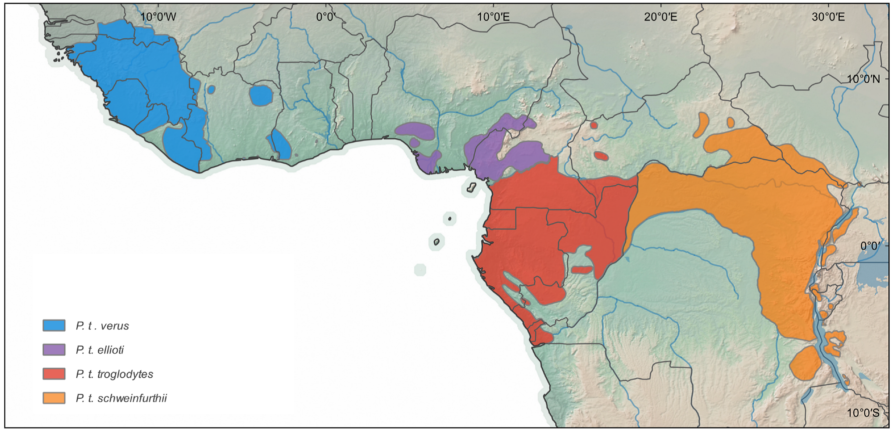

# Exercise in structured populations

## Program

  - Construction and interpret a Principal Component Analysis (PCA) plot using SNP data
  - Running and interpreting ADMIXTURE analyse using SNP data
  
## Learning objectives 

  - Introduce command-line based approach to structure analyses

  - Learn to interpret results from structure analyses and put these in
    a biological context
    
## Recommended reading

  - Chapter 4 in ”An introduction to Population Genetics” and
    chapter 5 page 99-103

## Referneces related to the data
  - Hvilsom et al. 2013. Heredity
    
    http://www.nature.com/hdy/journal/v110/n6/pdf/hdy20139a.pdf

  - Prado-Martinez et al. 2013. Nature
    
    http://www.nature.com/nature/journal/v499/n7459/pdf/nature12228.pdf

## Clarifying chimpanzee population structure and admixture using exome data

Disentangling the chimpanzee taxonomy has been surrounded with much
attention, and with continuously newly discovered populations of
chimpanzees, controversies still exist about the true number of
subspecies. The unresolved taxonomic labelling of chimpanzee populations
has negative implications for future conservation planning for this
endangered species. In this exercise, we will use 110.000 SNPs from the
chimpanzee exome to infer population structure and admixture of
chimpanzees in Africa, in order to acquire thorough knowledge of the
population structure and thus help guide future conservation management
programs. We make use of 29 wild born chimpanzees from across their
natural distributional area (Figure 1).


<figure>
  
 </figure>

**Figure 1** Geographical distribution of the common chimpanzee *Pan
troglodytes* (from Frandsen & Fontsere *et al.* 2020. [https://www.nature.com/articles/s41437-020-0313-0 ]).

## PCA

We start by downloading the exome data to the folder
`~/exercises/structure`. To do this you can use the following command.
Open a terminal and type:

```bash
cd ~/exercises   # if you do not have a directory called exercises, make one:  mkdir ~/exercises 
mkdir structure 
cd structure 
cp ~/groupdirs/SCIENCE-BIO-Popgen_Course/exercises/structure/pa.zip . 
unzip pa.zip 
rm pa.zip 
```

First, we want to look at the data (like you always should *before*
doing any analyses) by opening R in the exercise directory (don’t close
it before this manual states that you should) and typing:

#### \>R

```R
popinfo = read.table("pop.info")
table(popinfo[,1])
```

**Q2**: Which subspecies are represented in the data and how many
individuals are there from each?

Now we want to import our genotyped data into R. 
#### \>R

```R
library(snpMatrix)
data <- read.plink("pruneddata")
geno <- matrix(as.integer(data@.Data),nrow=nrow(data@.Data))
geno <- t(geno)
geno[geno==0]<- NA
geno<-geno-1
###Let’s take a look at the first SNP (across populations)
table(geno[1,])
###Let’s take a look at the first individual (across all SNPs)
table(geno[,1])
###Let’s take a look at the last individual (across all SNPs)
table(geno[,29])
```

**Q3**: The genotype format are of the type 0, 1, 2, explain what 0, 1
and 2 means? At the fist SNP: How many homozygotes are there? And how
many heterozygotes? For the first and last individual: How many
homozygotes are there? And how many heterozygotes?

Now we want to look at the principal components, type the following into
R:

#### \>R
```R
summary(prcomp(na.omit(geno)))
```
Q4: Look at column PC1 and PC2, how much of the variation is
explained if you were to use these two principal components?

Now we want to plot our genotyped data, we do that, first, by pasting
the following code into R (which is first function that does PCA and then a call to this to run PCA on your data):  

#### \>R
```R
eigenstrat<-function(geno){

# Get rid of sites with missing data
nMis<-rowSums(is.na(geno))
geno<-geno[nMis==0,]

# Get rid of non-polymorphic sites
avg<-rowSums(geno)/ncol(geno)
keep<-avg!=0&avg!=2
avg<-avg[keep]
geno<-geno[keep,]

# Get number of remaining SNPs iand individuals
snp<-nrow(geno)
ind<-ncol(geno)

# Make normalized genotype matrix
freq<-avg/2
M <- (geno-avg)/sqrt(freq*(1-freq))

# Get sample covariance matrix 
X<-t(M)%*%M
X<-X/(sum(diag(X))/(snp-1))

# Do eigenvalue decomposition
E<-eigen(X)

# Calculate stuff relevant for number of components to look at
mu<-(sqrt(snp-1)+sqrt(ind))^2/snp
sigma<-(sqrt(snp-1)+sqrt(ind))/snp*(1/sqrt(snp-1)+1/sqrt(ind))^(1/3)
E$TW<-(E$values[1]*ind/sum(E$values)-mu)/sigma
E$mu<-mu
E$sigma<-sigma
class(E)<-"eigenstrat"
E
}
plot.eigenstrat<-function(x,col=1,...)
plot(x$vectors[,1:2],col=col,...)
print.eigenstrat<-function(x)
cat("statistic",x$TW,"n")
e<-eigenstrat(geno)

```
And then use the next lines of code to make a plot in R:

#### \>R
```R
plot(e,col=rep(c("lightblue","Dark red","lightgreen"),c(11,12,6)),xlab="PC1 21% of variance",ylab="PC2 12% of variance",pch=16,main="PCA plot")
text(0, 0.18, "troglodytes")
text(0.05, -0.2, "schweinfurthii")
text(-0.32,-0.07,"verus")
```


**Q5**: When looking at the plot, does the number of clusters fit with
what you saw in the pop.info file? And does it make sense when looking
at Figure 1?
Now close R by typing `quit()` and hit `Enter` (it is up to you if you
wish to safe the workspace).


## Admixture

Now we know that the populations look like they are separated into three
distinct clusters (in accordance to the three subspecies), but we also
want to know whether there has been any admixture between the three
subspecies given that at least two of the subspecies have neighboring
ranges (Figure 1). For this admixture run, we will vary the input
command for the number of ancestral populations (*K*) that you want
ADMIXTURE to try to separate the data in. To learn more about admixture
the manual can be found here:

https://www.genetics.ucla.edu/software/admixture/admixture-manual.pdf

First we want to know whether the separation in three distinct
populations is the most true clustering given our data. We do this by
running a cross-validation test, this will give us an error value for
each K. We want to find the K with the lowest number of errors.

To do this, run the following lines of code in the terminal (this may
take some time \~3 mins):

```bash
for i in 2 3 4 5; do admixture --cv pruneddata.bed $i; done > cvoutput
grep -i 'CV error' cvoutput
```

**Q6**: which K value has the lowest CV error?

Try running ADMIXTURE using this K value, by typing this in the terminal
(remember to change the K-value to the value with the lowest amount of
errors):

```bash
admixture pruneddata.bed K-VALUE
```

Before we plot, we want a look at the results generated:

```bash
less -S pruneddata.3.Q
```

**Q7**: The number of columns indicate the number of K used and the rows
indicate individuals and their ancestry proportion in each population.
Look at individual no. 10, do you consider this individual to be
recently (within the last two generations) admixed?

Now we want to plot our ADMIXTURE results, to do this open R and pasting
the following code in:

#### \>R
```R
snpk2=read.table("pruneddata.2.Q")
snpk3=read.table("pruneddata.3.Q")
snpk4=read.table("pruneddata.4.Q")
snpk5=read.table("pruneddata.5.Q")
names=c("A872_17","A872_24","A872_25","A872_28","A872_35","A872_41",
        "A872_53","Cindy","Sunday","EXOTA_11785","PAULA_11784","SUSI_11043",
        "CINDY_11525","ABOUME","AMELIE","AYRTON","BAKOUMBA","BENEFICE",
        "CHIQUITA","LALALA","MAKOKOU","MASUKU","NOEMIE","SITA_11262",
        "SEPP_TONI_11300","A872_71","A872_72","AGNETA_11758","FRITS_11052")
par(mfrow=c(4,1))
barplot(t(as.matrix(snpk2)),
        col= c("lightblue","Dark red"),
         border=NA, main="K=2",
         names.arg=(names), cex.names=0.8, las=2, ylab="ancestry")
barplot(t(as.matrix(snpk3)),
        col= c("lightgreen","Dark red","lightblue"),
        border=NA, main="K=3",
        names.arg=(names), cex.names=0.8, las=2, ylab="ancestry")
barplot(t(as.matrix(snpk4)),
        col= c("lightgreen","Dark red","lightblue","yellow"),
        border=NA, main="K=4", names.arg=(names), cex.names=0.8, las=2,
        ylab="ancestry")
barplot(t(as.matrix(snpk5)),
        col= c("lightgreen","Dark red","lightblue","yellow","pink"),
        border=NA, main="K=5", names.arg=(names), cex.names=0.8, las=2,
        ylab="ancestry")
```

**Q8:** Looking at the plot, does it look like there has been any
admixture when using a K value of 3? Does this mean that there has not
been any admixture between any of the subspecies? Why / why not ?

**Q9:** In the K=4 plot, *P.t.troglodytes* (central chimpanzee) is
divided into two populations, have we overlooked a chimpanzee
subspecies?

**Q10:** Assuming you had no prior information about your data (e.g.
imagine you have a lot of data sequences sampled from random chimpanzee
individuals in a zoo) while using an ADMIXTURE analysis, would you be
able to reveal whether there had been any admixture between any of the
subspecies in nature? Why / why not?

Next, we are going to calculate the fixation index between subspecies
(*F<sub>st</sub>*), which is a widely used statistic in population
genetics. This is a measure of population differentiation and thus, we
can use it to distinguish populations in a quantitative way. To get you
started, we calculate *F<sub>st</sub>* by hand and then later using a
script. It is worth noticing that what *F<sub>st</sub>* measures is the
reduction in heterozygosity compared to a pooled population.

Here we will calculate the population differentiation in the gene
(***SLC24A5***) which contributes to skin pigmentation (among other
things) in humans. An allele (A) in this gene is associated with light
skin. The SNP varies in frequency in populations in the Americas with
mixed African and Native American ancestry. A sample from Mexico had 38%
A and 62% G; in Puerto Rico the frequencies were 59% A and 41% G, and a
sample of Africans had 2% A with 98% G.

Calculate *F<sub>st</sub>* in this example. Start by calculating
heterozygosity, then H<sub>s</sub> and then H<sub>T</sub>

|                | African        | Mexican         | Puerto Rican    |
| -------------- | -------------- | --------------- | --------------- |
|                | A (2%) G (98%) | A (38%) G (62%) | A (59%) G (41%) |
| Heterozygosity |                |                 |                 |

**Q11**: What is *F<sub>st</sub>* in this case?

**Q12**: Why is this allele not lost in Africans? What happened?

Here we use the Weir and Cockerham *Fst* calculator from 1984 to
calculate *F<sub>st</sub>* on the chimpanzees. Open R and copy/paste the
following:

#### \>R
```R
WC84<-function(x,pop){
#number ind each population
n<-table(pop)
###number of populations
npop<-nrow(n)
###average sample size of each population
n_avg<-mean(n)
###total number of samples
N<-length(pop)
###frequency in samples
p<-apply(x,2,function(x,pop){tapply(x,pop,mean)/2},pop=pop)
###average frequency in all samples (apply(x,2,mean)/2)
p_avg<-as.vector(n%*%p/N )
###the sample variance of allele 1 over populations
s2<-1/(npop-1)*(apply(p,1,function(x){((x-p_avg)^2)})%*%n)/n_avg
###average heterozygotes
# h<-apply(x==1,2,function(x,pop)tapply(x,pop,mean),pop=pop)
#average heterozygote frequency for allele 1
# h_avg<-as.vector(n%*%h/N)
#faster version than above:
h_avg<-apply(x==1,2,sum)/N
###nc (see page 1360 in wier and cockerhamm, 1984)
n_c<-1/(npop-1)*(N-sum(n^2)/N)
###variance betwen populations
a <-n_avg/n_c*(s2-(p_avg*(1-p_avg)-(npop-1)*s2/npop-h_avg/4)/(n_avg-1))
###variance between individuals within populations
b <- n_avg/(n_avg-1)*(p_avg*(1-p_avg)-(npop-1)*s2/npop-(2*n_avg-1)*h_avg/(4*n_avg))
###variance within individuals
c <- h_avg/2
###inbreedning (F_it)
F <- 1-c/(a+b+c)
###(F_st)
theta <- a/(a+b+c)
###(F_is)
f <- 1-c(b+c)
###weigted average of theta
theta_w<-sum(a)/sum(a+b+c)
list(F=F,theta=theta,f=f,theta_w=theta_w,a=a,b=b,c=c,total=c+b+a)
}
```

Now read in our data. We want to make three comparisons.

#### \>R
```R
library(snpMatrix)
data <- read.plink("pruneddata")
geno <- matrix(as.integer(data@.Data),nrow=nrow(data@.Data))
geno <- t(geno)
geno[geno==0]<- NA
geno<-geno-1
g<-geno[complete.cases(geno),]
pop<-c(rep(1,11),rep(2,12),rep(3,6))
### HERE WE HAVE OUR THREE COMPARISONS
pop12<-pop[ifelse(pop==1,TRUE,ifelse(pop==2,TRUE,FALSE))]
pop13<-pop[ifelse(pop==1,TRUE,ifelse(pop==3,TRUE,FALSE))]
pop23<-pop[ifelse(pop==2,TRUE,ifelse(pop==3,TRUE,FALSE))]
g12<-g[,ifelse(pop==1,TRUE,ifelse(pop==2,TRUE,FALSE))]
g13<-g[,ifelse(pop==1,TRUE,ifelse(pop==3,TRUE,FALSE))]
g23<-g[,ifelse(pop==2,TRUE,ifelse(pop==3,TRUE,FALSE))]
result12<-WC84(t(g12),pop12)
result13<-WC84(t(g13),pop13)
result23<-WC84(t(g23),pop23)
mean(result12$theta,na.rm=T)
mean(result13$theta,na.rm=T)
mean(result23$theta,na.rm=T)
```

**Q13:** Does population differentiation fit with the geographical
distance between subspecies and their evolutionary history?
