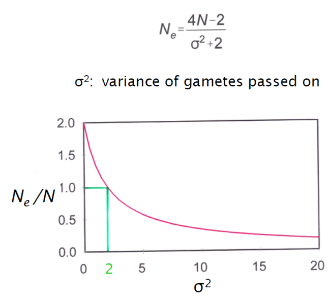

# Quantitative genetics

**Hans R Siegismund**

The focus of these exercises is to

  - partition the phenotypic variance of a quantitative trait
  - estimate the heritability for two human traits, height and number of children
  - study the effect of prolonged selection on the heritability of a trait.
    
**Exercise 1**
In this exercise, we will analyse quantitative genetic variation in
humans. The data has been collected in a course on evolutionary
biology at the University of Copenhagen.

Please note, that the number of children for the different generations
is biased. We do of course not include the individuals in the parent
or grandparent generation that did not get a child.

Move to the exercises directory and create the
QuantitativeGenetics folder and get the data (human.txt) .

```bash
cd ~/exercises
mkdir QuantitativeGenetics 
cd QuantitativeGenetics
cp ~/groupdirs/SCIENCE-BIO-Popgen_Course/exercises/QuantitativeGenetics/human.txt .
```
Once the data have been copied wo the
QuantitativeGenetics folder, one can view them on the screen with the head command

```bash
head human.txt
```

It looks like this


|||||||||
|----|---|----|----|----|----|----|----|
|Sex   | Height| HeightF| HeightM| ChildFF| ChildF| ChildMM| ChildM|
|female| 172| 178| 167| 3| 2| 2| 2|
|female| 165| 170| 168| 2| 1| 2| 1|
|female| 173| 167| 171| 4| 2| 4| 2|
|female| 168| 197| 168| 2| 2| 3| 2|
|female| 166| 175| 160| 4| 4| 5| 4|
|female| 162| 189| 158| 2| 2| 2| 2|
|female| 180| 182| 160| 5| 2| 2| 2|
|female| 180| 186| 178| 3| 3| 2| 2|
|female| 176| 196| 166| 2| 1| 2| 1|

which is (almost) self-explanatory 


| |
|----|
|Height is in cm|
|F Father |
|M Mother|
|FF Father's father |
|MM Mother's mother|


We want to estimate the "narrow sense" heritability, *h*<sup>2</sup>, for the
traits height and number of offspring. The "narrow sense" heritability
is defined as the fraction of the additive genetic variance, *V<sub>A</sub>*, of
the total phenotypic variance, *V<sub>P</sub>*,

*h*<sup>2</sup> = *V<sub>A</sub>*/*V<sub>P</sub>*

However, not always do we have a direct way to calculate *V<sub>A</sub>*. Luckily,
in some experimental designs, the heritability can be estimated from
regression among relatives. It can be shown that the heritability equals
the regression coefficient *b* between the offspring and the *average
midparent* value for a trait

*h*<sup>2</sup><sub>*N*</sub> = *b*

If the regression is carried out between offspring and a *single
parent,* it can be shown that the heritability is equal to twice the
regression coefficient between the offspring and the parent,

*h*<sup>2</sup><sub>*N*</sub> = 2*b*.

The regression coefficient *b* is found as

*b* = *Cov*( *x*, *y*)/*V* (*x*)

*Cov*(*x*, *y*) is the covariance among *x* and *y.* However, programing
languages like R calculate the regression coefficient directly from the
data, provided that one has specified a model.

For the two hypothetical variables x and y mentioned above, one
specifies the regression model using the very simple lm function

1) Read the data into R, take a look at the distribution for the two sexes
in the two generations, and get a summary of the data

#### >R

```R
###Set the path to the folder with your data.
setwd("~/exercises/QuantitativeGenetics")
human <- read.table(file="human.txt",header = TRUE, dec="t")
###How does the data look like?
head (human)
###First, we partition the data set into male and female data sets
females <- human[human$Sex=="female",]
males <- human[human$Sex=="male",]
par(mfrow=c(2,2))     ###Graphics window with 2 x 2 figures
hist(females$Height,xlim=c(150,210),ylim=c(0,60),breaks=6,las=1,
    ylab="Number",xlab="Height",main="Female students")
abline(v=mean(females$Height), col="red")
hist(males$Height,xlim=c(150,210),ylim=c(0,30),breaks=6,las=1,
     ylab="Number",xlab="Height",main="Male students")
abline(v=mean(males$Height), col="red")
hist(females$HeightM,xlim=c(150,210),ylim=c(0,60),breaks=6,las=1,
     ylab="Number",xlab="Height",main="Female students' mothers")
abline(v=mean(females$HeightM), col="red")
hist(males$HeightF,xlim=c(150,210),ylim=c(0,30),breaks=6,las=1,
     ylab="Number",xlab="Height",main="Male students' fathers")
abline(v=mean(males$HeightF), col="red")
summary(human)
```
2)  Take a look at the mean of female students and their mothers. 
    And look at the "Mean" for the Height variable and the HeightM variable. How
    does the mean change over the generations?

#### >R
```R
summary(females)
```


3)  Do the same for male students. 

#### >R
```R
summary(males)
```


4)  Is there any sign of assortative mating with regard to height? (That
    is, do people prefer a partner like themselves?)

To answer this, we can see if there is a relationship between the height
of the father and the height of the mother. First, we plot all the points.
Then we create a model and summarize it.

#### >R
```R
par(mfrow=c(1,1))   ###Graphics window with 1 figure
plot(jitter(human$HeightF,factor=2),jitter(human$HeightM,factor=2),
     pch=20,cex=0.8,
     xlim=c(160,200),ylim=c(150,190),
     xlab="Height of fathers", ylab= "Height af mothers",las=1)
model <- lm(human$HeightM~human$HeightF)
abline(model, col="red")   ###Regression line
summary(model)
```


5)  Take a look at the distribution of number of offspring for the two
    different generations for each sex separately. We do this by creating the histograms 

```R
brk<- seq(0, 15,1)   ###Set inervals for the histograms
par(mfrow=c(2,2))    ###Graphics window with 2 x 2 figures
maxChild <- 15
CM<- hist(human$ChildM,xlim=c(0,maxChild),ylim=c(0,150),las=1,
          breaks=brk,ylab="Number",xlab="Children",main="Children of mothers")
abline(v=mean(human$ChildM), col="red")
CF<- hist(human$ChildF,xlim=c(0,maxChild),ylim=c(0,150),las=1,
          breaks=brk,ylab="Number",xlab="Children",main="Children of fathers")
abline(v=mean(human$ChildF), col="red")
CMM<- hist(human$ChildMM,xlim=c(0,maxChild),ylim=c(0,100),las=1,
           breaks=brk,ylab="Number",xlab="Children",main="Children of moms mothers")
abline(v=mean(human$ChildMM), col="red")
CFF<- hist(human$ChildFF,xlim=c(0,maxChild),ylim=c(0,100),las=1,
           breaks=brk,ylab="Number",xlab="Children",main="Children of dads fathers")
abline(v=mean(human$ChildFF), col="red")
```
 

6)  How does the maximum number of children change over the generations?
    Use the summary function again and look for the Max. row

```R
summary(human)
```


7)  How do the mean and variance change among generations?

The mean can be found in the data summary. The variance can be
calculated using these commands

```R
var(human$ChildM)
var(human$ChildMM)
var(human$ChildF)
var(human$ChildFF)
```

8)  Take a look at the variance in the different generations. From the
    change of the variances would you predict that genetic drift has
    increased or decreased over the generations?

It can be shown that for the Wright-Fisher model the variance (σ<sup>2</sup>) in
number of gametes passed on to the next generation is equal to 2. In
that case, the census population size is equal to the effective
population size. Effective population size is inversely related to
genetic drift (i.e. smaller populations undergo more drift and vice
versa).

The effective population size differs from the census size as
illustrated in this figure

<figure>
  
 </figure>

We can see that the smaller the variance in gametes passed on, the
larger the effective population size is relative to the census size.
The variance in number of offspring was 
substantially smaller for the students' parental generation than for the
grandparental generation. Therefore, genetic drift has decreased.

9)  Estimate the "narrow sense" heritability for height in humans (for
    both sexes separately). Start by making plots for males and females.

```R
par(mfrow=c(1,2))
###Females:
females$AveHeightParents<-(females$HeightF+females$HeightM)/2
plot(jitter(females$AveHeightParents,factor=2),jitter(females$Height,factor=2),xlim=c(160,190),
      ylim=c(150,205),xlab="Mean of parents height", ylab= "Height of daughters",las=1,
      main="Heritability of height in women")
abline(lm(females$Height~females$AveHeightParent), col="red")
summary(lm(females$Height~females$AveHeightParents)) #to see the significance of the coefficients
#####Males:
males$AveHeightParents<-(males$HeightF+males$HeightM)/2
plot(jitter(males$AveHeightParents,factor=2),jitter(males$Height,factor=2),xlim=c(160,190),
      ylim=c(165,205),xlab="Mean of parents height", ylab= "Height of sons",las=1,
      main="Heritability of height in man")
abline(lm(males$Height~males$AveHeightParents), col="red")
summary(lm(males$Height~males$AveHeightParents)) #to see the significance of the coefficients
```


We can summarize the two regression models for
males and females, and look for the regression coefficient in the
results. Remember that the regression coefficients are actually the
estimates of the heribality of height
```R
###Females:
summary(lm(females$Height~females$AveHeightParents)) #to see the significance of the coefficients
#####Males:
summary(lm(males$Height~males$AveHeightParents)) #to see the significance of the coefficients
```


10) Estimate the "narrow sense" heritability for number of offspring in
    humans (for both sexes separately). Remember that the heritability
    is twice the slope; we have to multiply the
regression coefficients by 2, because we use only half of the parents in
the regression. We start by plotting the distributions for the two sexes.

```R
library(hexbin)
par(mfrow=c(1,2))
sunflowerplot(human$ChildMM,human$ChildM,xlim=c(1,12),
      ylim=c(1,12),xlab="Children of father's father", ylab= "Children of father",las=1,
      )
sunflowerplot(human$ChildFF,human$ChildF,xlim=c(1,12),
      ylim=c(1,12),xlab="Children of mother's mother", ylab= "Children of mother",las=1,
     )
summary(lm(human$ChildM~human$ChildMM)) #to see the significance of the coefficients
summary(lm(human$ChildF~human$ChildFF)) #to see the significance of the coefficients
```


11) The heritabilities for height and number of offspring differ
    substantially. Can this be used to explain to what degree the change
    among generations in these two traits are caused by genetic or
    environmental causes?


12) Are Danes monogamous? Answer this question by comparing the number
    of offspring of fathers and mothers.

```
par(mfrow=c(1,1))
sunflowerplot(human$ChildF,human$ChildM,xlim=c(1,7),
              ylim=c(1,7),xlab="Children of father", ylab= "Children of mother",las=1, )
```


**Exercise 2**

In a long-term experiment selecting for high oil content in corn seeds,
the oil content was 6% and 12% after 5 and 50 generations, respectively.
In the two generations, the results of directional selection were


|   |    |   | 
|:---:|:----:|:---:| 
|Generation | Oil content among selected |Oil content among offspring|
| 5  | 7%  | 6.3%   |
| 50 | 14% | 12.24% |

1)  What is the heritability for oil content in generation 5 and 50?


2)  Why do the heritabilities differ in the two generations?


3)  What will the heritability be when a plateau is being reached where
    there no longer is a response observed?


4)  Are the loci contributing to the trait (at the plateau) fixed?


