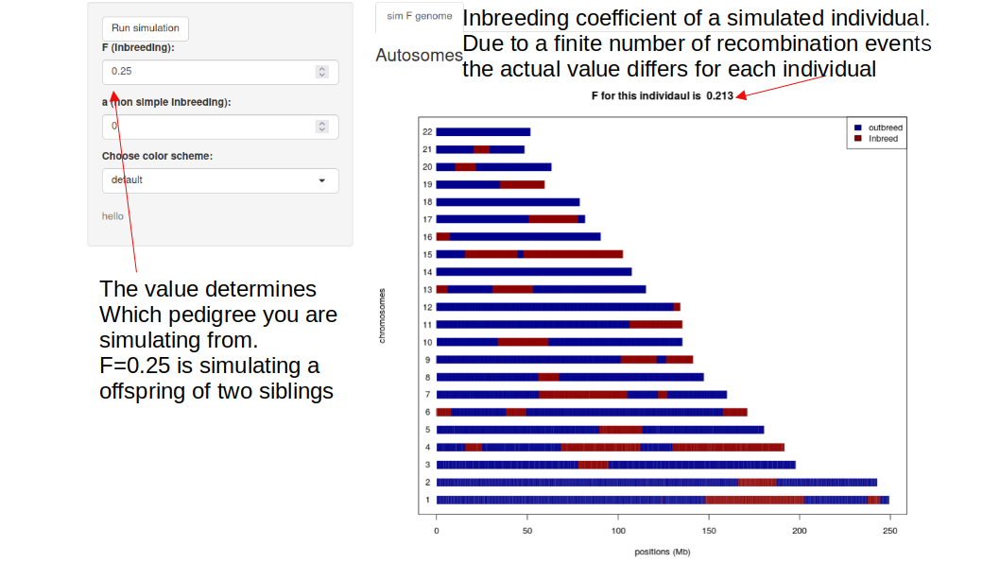
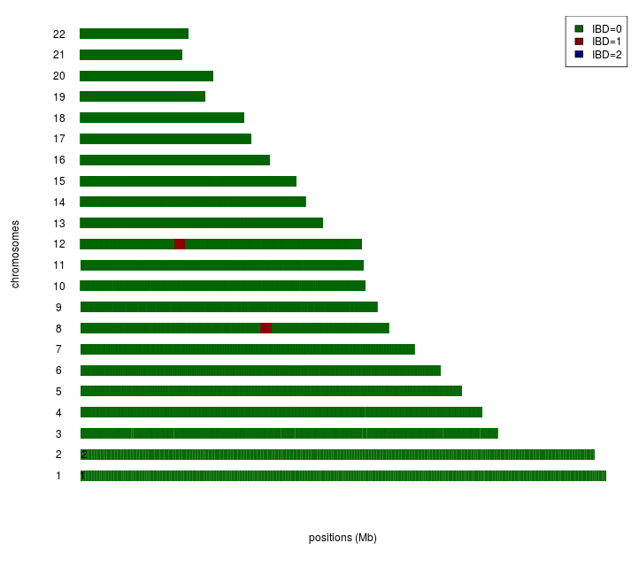

# Inbreeding
You have gotten access to DNA from an individual and using genetic markers across the genome you estimate that the inbreeding coefficient to F=0.062
  - Is this high compared to what you would expect for a Human?
  - What the most simple pedigree that could give rise to such an estimate?
  - - Hint 1: Look at the “Estimation of inbreeding coefficient from pedigrees” slides from earlier


  - Go to http://popgen.dk:3838/anders/popgen2016/Fgenome/ to simulate the 22 autosomes for a Human. 
  - - If it is slow to respond you can use a local version(see below)
  - - Try to simulate an individuals from this simple pedigree (use the expected F from such a pedigree, don’t use “a”)


 <p align="center">
   
 <br> 
 </p>  
- Note the simulated inbreeding coefficient for this individual. Why is it not the same as the F you entered?
  - Note the length of the inbreeding tracts. What determines how long they are?
  - Note the number of chromosomes that do not have inbreeding tracts. Try to draw how this might happen
  - Try to get an idea of the range of possible inbreeding coefficients by trying multiple simulations (still using the same F)
  - Look in table https://www.researchgate.net/profile/Alan-Bittles-2/publication/38114212/figure/tbl1/AS:601713388052509@1520471059919/Human-genetic-relationships.png  of simple consanguineous pedigrees.  Does your range overlap with the expected inbreeding coefficients?
  
  - Try a few simulations of some of the other simple pedigrees and try to see which pedigrees could explain your estimated inbreeding value of 0.062?
  - If you infer the inbreeding tracks of your individuals the results will look like this http://popgen.dk/albrecht/embo2015/FforInd.png. Is this consistent with your suggested pedigrees? Or which other explanations could there be for the estimated F?


## run locally 
open R on you desktop (not the server). Then run
```R
# if shiny is not ins
if (!require("shiny")) install.packages("shiny")
runUrl("http://popgen.dk:3838/anders/popgen2016/Fgenome.tar.gz")
```
  
 
 
 
 
# Relatedness

Here is shown the IBD sharing between two individuals on chromosome 1. 

 <p align="center">
   
 <br> 
 </p>  


  - Assuming no previous inbreeding in the population what is the only relationship that can produce such IBD patterns?
  - Assuming both individuals has a rare recessive disorder, where on the chromosome might the disease gene be located?


  - Here is a figure of two distantly related individuals both with the same rare disorder. They share 0.3% of their genome IBD=1
 
 <p align="center">
   
<br />
 </p>  


  - These individuals share two regions IBD. What assumption do we have to have in order to conclude that the disease causing locus is in one of these regions?
  - For relatedness mapping do you think it is best to have close or distantly related individuals?
  - Try to guess the number of generations that separate these two individuals?
  - They are actually separated by 14 generations. Try to see if you can get a similar pattern using simulations http://popgen.dk:3838/anders/popgen2016/Rgenome/
  - - If slow then run locally (see below)
  - What explains the difference between your simulations and above plot?


## run locally 
log into popgen servers and open R. Then run
```R
# if shiny is not ins
if (!require("shiny")) install.packages("shiny")
runUrl("http://popgen.dk:3838/anders/popgen2016/Rgenome.tar.gz")
```
  
