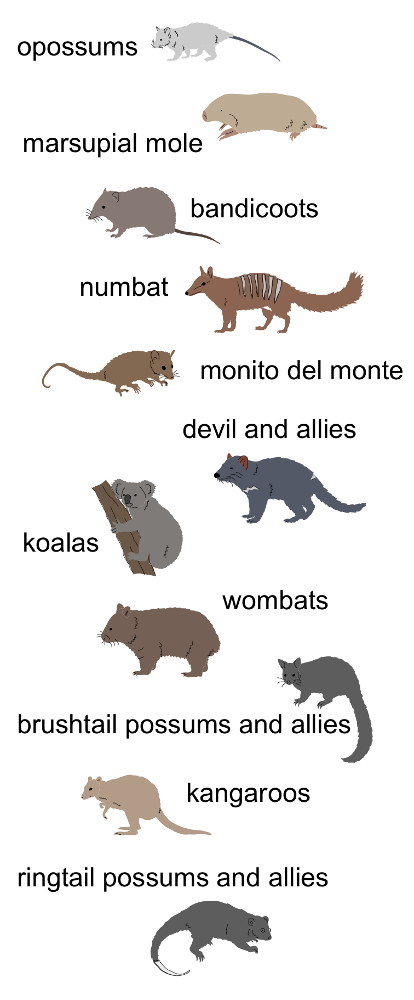

# Phylogenomics

**David A. Duchene**

Marsupials are a group of mammals that are unique to Australasia and the Americas. Several major groups of marsupials first appeared between 50 and 70 million years ago, during events of fast diversification. Given these are ancient and fast events, resolving the relationships among early marsupials is difficult, and remains a matter of interest in mammalian biology.

These exercises focus on the most critical steps of a phylogenomic analysis, with the aim of resolving longstanding questions of the evolution of Australasian marsupials.

<figure>
  
</figure>

### Exercise 1: Sequence alignment

a) Open MEGA and open the file marsupials.fasta via File > Open A File, and selecting Align. Have a look at the sequences and notice that they have slightly different lengths.

**Question 1.** Before we conduct any phylogenetic analyses, we need to align these sequences. What is the purpose of sequence alignment?

  
Answer:

*The purpose of sequence alignment is to maximise the number of sites that we can infer as including homologous characters (i.e., those that have been inherited from a common ancestor). Sequences are aligned by inserting "gaps" where insertions and deletions are likely to have occurred.*

b) Try for a few minutes to align these sequences by eye. To do this, use your mouse to select one of the nucleotides. Then you can add "gaps" with your spacebar or use the left and right arrow symbols at the top of the window to move that block of columns left and right. You can also use the keyboard, by using alt + the arrow keys.

To get you started, try simply adding a single gap to the start of sequences 1, 3, 5, 6, 7, and 10. Notice that several of the sequences now appear to be better aligned, but this is only the case for a few of the successive nucleotides. Also try adding gaps to the start of sequences 4 and 9 until they align with the rest of the data set.

c) Now create an automated alignment by clicking on the Alignment menu and choosing Align by Muscle, selecting all the sequences. Muscle is one of the two alignment algorithms in MEGA. The other is ClustalW. These two are widely used alignment algorithms. We will use Muscle for this practical.

Change the “Gap Open” penalty to -1000. This increases the penalty for inserting gaps in the alignment, meaning that Muscle will be less willing to insert gaps to make the sequences better aligned to each other. Click “OK”.

**Question 2.** How long is the sequence alignment?

  
Answer:

*This sequence alignment is 1318 sites long.*

d) Now run Muscle again, but with a “Gap Open” penalty of -400.

**Question 3.** Has the length of the sequence alignment changed, and which of the alignments seems more acceptable?

  
Answer:

*The length of the alignment has slightly increased to 1321. The reduced penalty for inserting gaps has led to the addition of a few sites overall.*

In this practical we will accept the results of the automated alignment, but standard practice is to inspect the alignment to see if the automated method has done a good job.

In some cases, visual inspection can reveal sections of the alignment that can be improved. Nowadays, many sequence data sets are far too large for visual inspection to be feasible. As a consequence, there is an increasing reliance on automated methods of identifying misleading sequences and alignment regions.

**Question 4.** If one of your sequences had accidentally been shifted to the right by 1 nucleotide (so that the sequence was misaligned by 1 nucleotide compared with the remaining sequences), what would be the consequences for phylogenetic analysis?

  
Answer:

*This would lead to a very large estimated genetic divergence between this sequence and the rest of the data set. Overall, we would estimate the data set to have a very large substitution rate. The branch leading to that taxon would be estiamted to be very long, and the taxon would probably be placed incorrectly as a distant relative of all other taxa.*

### Exercise 2: Tree building

Now that we have a sequence alignment, we are ready to perform phylogenetic analyses. We will perform phylogenetic analysis using maximum likelihood. Our aim will be to make estimates of the tree and branch lengths. This method uses an explicit model of molecular evolution.

a) From your alignment window, click on the Data tab in the top bar and on Phylogenetic Analysis. Select "Yes" when prompted whether your data are protein-coding. Now go to the main MEGA window. From the Phylogeny menu, select "Construct Maximum Likelihood Tree" and use the active data set. This will bring up a box that contains a range of options for the analysis.

Check that the options are the following:
Test of Phylogeny: Bootstrap method
No. of Bootstrap Replications: 100
Substitutions Type: Nucleotide
Model/Method: General Time Reversible model
Rates among Sites: Gamma distributed (G)
No of Discrete Gamma Categories: 5
Gaps/Missing Data Treatment: Use all sites

Click "OK" to start the maximum likelihood phylogenetic analysis, which will take about 5 minutes to complete.

b) Confirm that the tree is rooted with the Opossum as the sister of all other marsupials. If this is not the case, select the branch of the Opossum and select "Place Root on Branch".

**Question 5.** There is a scale bar underneath the tree. What units does it measure?

  
Answer:

*The scale bar measures expected molecular substitutions per site.*

**Question 6.** What is the purpose of including an external species, or outgroup (in this case the Opossum), in the analysis?

  
Answer:

*The inclusion of an external species allows us to infer the position of the root and therefore the order of divergence events in time.*

**Question 7.** Does it look like this tree has strong statistical support?

  
Answer:

*Some branches have high support, but most ancient or "deep" branches have very low support. This means that we cannot draw strong conclusions about the early divegence of marsupials from the genomic region analysed.*

### Exercise 3: Substitution models

In order to conduct a reliable phylogenetic analyses, we need to identify the best-fitting model of nucleotide substitution for the data set. A key purpose of substitution models is to account for multiple substitutions.

Perhaps the most widely used substitution model is the General Time Reversible (GTR) model, which allows different rates for different substitution types. For example, it allows A<->G substitutions to occur at a different rate from C<->G substitutions. The model also allows the four nucleotides to have unequal frequencies.

**Question 8.** Which is the most simple substitution model, and why?

  
Answer:

*Jukes-Cantor is the most simple model because it assumes that the transition probabilities among all nucleotides are identical. Base frequencies are also assumed to be equal.*

Variation in evolutionary rate across sites can be modelled using a gamma distribution, which can take a broad range of shapes. The distribution can be described using a single parameter, alpha. When alpha is small (<1), most sites are assumed to be slow-evolving, while a small portion of sites are assumed to be faster evolving (e.g., because they are not undergoing selective constraints). When alpha is large (>1) most sites are taken to evolve at approximately the same rate.

We can use MEGA to compare different models and select the one that best suits our data.

a) Return to the main MEGA window. From the Models menu, select "Find Best DNA/Protein Models (ML)" and use the active data. This will bring up a box that contains set of options. Click "Compute" without making any changes.

**Question 9.** Which is the best model as identified by having the lowest AICc and BIC?

  
Answer:

*The model with the lowest AICc and BIC is the K2+G model. This model allows for different rates for transitions versus transversions, while assuming equal base frequencies. It also takes evolutionary rates across sites to follow a gamma distribution.*

**Question 10.** For the K2+G model, what is the value of the alpha parameter of the gamma distribution? And what does that indicate about the variation in rates across sites in these data?

  
Answer:

*The alpha parameter is estimated to be 0.56. This is much below 1, and suggests that there is substantial amounts of rate variation across sites. This means that many sites are evolving slowly and a few sites are evolving rapidly.*

**Question 11.** Are there differences in the results when using the JC versus the K2+G models? What does this say about the data?

  
Answer:

*While some branches have different length, the relationships are identical regardless of the model used for inference. This suggests that the tree signal is robust to the substitution model used.*

### Exercise 4: Gene trees

Population-level processes can lead gene trees to vary among them. In some cases, this is a dominant form of variation and can be modelled using the multi-species coalescent.

a) Open FigTree and the marsupials.tree file via File > Open and navigating to the file. This file contains a large number of trees from genes across the genomes of marsupials. The first gene tree will be shown in your window. Scroll across gene trees using the Prev/Next arrows at the top-right of the window.

**Question 12.** Some branches seem to be missing or collapsed in some of the trees. What does this indicate about the phylogenetic information in the gene?

  
Answer:

*These branches are not missing but are extremely short (they effectively have length 0). This suggests that the genes contain very little information about these parts of the tree. One explanation is that these events happened in quick succession, such that no molecular changes occurred.*

b) In the Layout panel on the left, toggle the tree layout to Radial, and once again explore a few trees.

**Question 13.** Which are the most consistent sets of relationships across gene trees?

  
Answer:

*The koala and wombat are nearly always identified as sister clades, and so are the tasmanian devil and numbat. The grouping of the two possums and the kangaroo are also very common. Gene trees seem to have substantial incongruence regarding other relationships.*

**Question 14.** Among which groupings is there apparent incomplete lineage sorting in this tree, and what does that indicate about the ancestral populations of different groups of marsupials?

  
Answer:

*The relationships among the possums and the kangaroos seem to be affected by incomplete lineage sorting, as are the relationships at the root of the marsupial mole branch. This suggests that there was substantial exchange in the early stages of the diversification of these groupings of marsupials. These divergences were likely very fast events and population sizes relatively large, leading to incomplete lineage sorting and therefore widespread incongruence among gene trees.*

